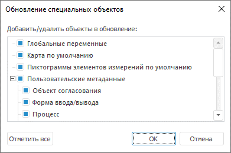
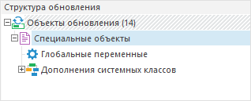

# Добавление специальных объектов

Добавление специальных объектов
-

# Добавление специальных объектов

При добавлении в обновление доступны специальные объекты репозитория:

	- [глобальные
	 переменные](UiNav.chm::/02_Navigator/UiNav_GlobalVariables.htm);

	- [карта
	 по умолчанию](UiNav.chm::/02_Navigator/Repo_Default.htm);

	- [пиктограммы
	 элементов измерений по умолчанию](UiNav.chm::/02_Navigator/Repo_Default.htm);

	- [пользовательские
	 метаданные](UiDevEnv.chm::/04_NavigatorSetting/Classes_Object/UiNav_Classes_Object.htm).

Примечание.
 При [разделении
 ролей администраторов](Admin.chm::/04_SecurityPolicy/Editor_of_Politicy/Security_EditorPoliticy_Adm.htm) и в зависимости от выбранного
 метода [разграничения
 доступа](Admin.chm::/04_SecurityPolicy/Admin_SecPolicy.htm) возможны [различия
 в доступе](../FAQ/FAQ.htm) к элементам обновления, а также к параметрам обновления
 объекта.

Для добавления специального объекта в обновление:

	- выполните команду «Добавить
	 специальные объекты» в контекстном меню [структуры
	 обновления](../Admin_UpMBObj_RunManager.htm);

	- выберите тип объекта обновления «Специальные
	 объекты» в раскрывающемся меню кнопки 
	 «Добавить объект в обновление»
	 на панели инструментов.

Примечание.
 Добавление специальных объектов доступно только в настольном приложении.

После выполнения одного из действий будет открыт диалог «Обновление
 специальных объектов»:

В иерархическом списке установите флажки напротив специальных объектов,
 которые должны быть добавлены в обновление.

## Варианты отметки

[Отметить все](javascript:TextPopup(this))

	Для отметки всех объектов:

		- нажмите кнопку «Отметить
		 все»;

		- выполните команду контекстного меню «Отметить
		 все».

	Для снятия флажков со всех объектов выполните команду контекстного
	 меню «Снять отметку со всех».

[Отметить уровень](javascript:TextPopup(this))

	Для отметки выбранного уровня объектов выполните команду контекстного
	 меню «Отметить уровень».

	Для снятия отметки с выбранного уровня объектов выполните команду
	 контекстного меню «Снять отметку
	 с уровня».

[Отметить подчиненные
 по уровню](javascript:TextPopup(this))

	Для отметки подчиненных по уровню элементов выбранного специального
	 объекта выполните команду контекстного меню «Отметить
	 подчиненные по уровню».

	Для снятия отметки с подчиненных по уровню элементов специального
	 объекта выполните команду контекстного меню «Снять
	 отметку с подчиненных».

После добавления специальных объектов в структуре обновления появится
 папка со специальными объектами:

## Операции со специальными объектами

После добавления в обновление специальных объектов доступны следующие
 операции:

[Редактирование
 состава специальных объектов](javascript:TextPopup(this))

	Для редактирования состава специальных объектов дважды щёлкните
	 по папке «Специальные объекты».
	 Будет открыт диалог «Обновление специальных
	 объектов». В папку «Специальные
	 объекты» невозможно добавить объект, который не является специальным.

[Удаление специальных
 объектов](javascript:TextPopup(this))

	Любой из специальных объектов может быть [удален
	 из обновления](Admin_CreateUpdate_DelObjects.htm). При удалении папки «Специальные
	 объекты», содержащей дочерние элементы, будет отображен запрос
	 на удаление зависимых объектов. Отрицательный ответ на запрос приводит
	 к перемещению дочерних элементов на уровень вверх, папка «Специальные
	 объекты» будет удалена из обновления.

После добавления в обновление специального объекта репозитория для создания
 других объектов или для использования объектов, которые необходимо включить
 в обновление, выполните соответствующую команду контекстного меню «Состоит из» или «Входит
 в» специального объекта. Будет открыто окно «[Состоит
 из»/«Входит в](Admin_CreateUpdate_AddObjects.htm#consists_of_or_included_in)».

См. также:

[Создание
 обновления](Admin_CreateUpdate.htm) | [Добавление субъекта
 безопасности](Admin_CreateUpdate_AddUser.htm)

		Справочная
		 система на версию 10.9
		 от 18/08/2025,
		 © ООО «ФОРСАЙТ»,
