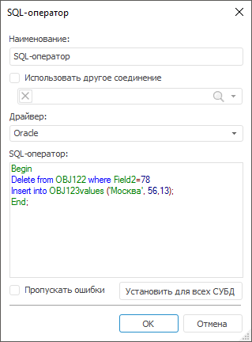
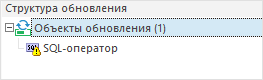
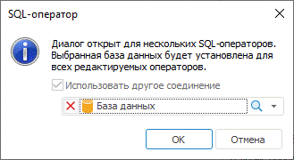

# Параметры SQL-оператора

Параметры SQL-оператора
-

# Параметры SQL-оператора

Диалог «SQL-оператор» может
 быть открыт при создании или редактировании [SQL-оператора](Admin_CreateUpdate_AddSQL.htm).

Настройте параметры SQL-оператора:

	- Наименование. Задает
	 наименование для SQL-оператора. По умолчанию используется «SQL-оператор».

	- Использовать другое соединение. При установке флажка становится
	 доступным поле с выбором базы данных из репозитория. При выборе базы
	 данных автоматически выставляется драйвер в поле «Драйвер»,
	 указанный в настройках выбранной БД. Для очистки поля нажмите на кнопку
	 .
	 В момент обновления SQL-оператор будет выполняться в указанном соединении
	 в соответствии с настройками БД.

	- Драйвер. При создании
	 или открытии на редактирование SQL-оператора в поле выставляется драйвер,
	 соответствующий настройкам текущего репозитория, где создается или
	 открывается обновление. Если для оператора используется другое соединение,
	 то драйвер будет выставлен в соответствии с настройками указанной
	 БД. В раскрывающемся списке выберите тип СУБД. Более подробно о доступных
	 СУБД читайте в подразделе «[Поддерживаемые СУБД](Setup.chm::/01_SysReq/database_Support.htm)».

	- SQL-оператор.
	 В поле необходимо написать текст оператора. При написании можно
	 использовать подсказки с ключевыми словами (SELECT, DROP, ALTER) и
	 с объектами репозитория или базы данных, указанной в другом соединении.
	 В тексте оператора можно использовать:

	-

		- скобки «Begin...end;». Внутри скобок допускается написание
		 нескольких SQL-выражений. Для разделения SQL-выражений внутри
		 скобок используется знак «;». Пример SQL-оператора:

begin

delete
 from OBJ32305 where
 Field2=78;

insert
 into OBJ32305 values('Москва',
 56,13);

end;

		- знак «/» для разделения нескольких SQL-выражений. Разделитель
		 должен быть единственным символом в строке. Пример SQL-оператора:

delete
 from OBJ32305 where
 Field2=78

/

insert
 into OBJ32305 values('Москва',
 56,13)

		- знак «;» для разделения нескольких SQL-выражений. Разделитель
		 располагается в конце SQL-выражения. Пример SQL-оператора:

delete
 from OBJ32305 where
 Field2=78;

insert
 into OBJ32305 values('Москва',
 56,13)

Вводимый текст оператора автоматически сохраняется
 для установленного драйвера. Каждому драйверу можно задать свой текст.
 При смене драйвера отображается текст, который ему был ранее задан.

Примечание.
 Для драйверов Oracle недопустимо отдельное использование разделителя «;».
 Использование данного разделителя допустимо только внутри «Begin...end;».

	- Пропускать ошибки. Установка флажка позволяет пропустить
	 выполнение SQL-оператора, если при его выполнении возникли ошибки
	 (сообщение об ошибке не выдается), и продолжить процесс обновления
	 со следующего элемента. При снятом флажке в случае возникновения ошибки
	 при выполнении SQL-оператора процесс обновления будет прерван сообщением
	 об ошибке.

	- Установить для всех СУБД.
	 Команда устанавливает текущий текст SQL-оператора для всех драйверов
	 СУБД. При выполнении команды запрашивается подтверждение на выполнение
	 операции.

Примечание.
 Если для других драйверов СУБД текст не был задан, то сообщение не появится.

## Диалог для нескольких SQL-операторов

При открытии обновления может быть не найдена база данных у SQL-оператора,
 указанная в соединении при установленном флажке «Использовать
 другое соединение». В этом случае около оператора будет отображена
 измененная пиктограмма:

Необходимо проверить настройки оператора,
 открыв диалог с его параметрами. Если есть несколько операторов, требующих
 проверки параметров, то можно вызвать диалог редактирования для всех выбранных
 и одновременно указать базу данных. В этом случае диалог с параметрами
 примет вид:

Следует выбрать базу данных из объектов репозитория. Выбранная база
 данных будет установлена для всех редактируемых SQL-операторов.

См. также:

[Работа
 с SQL-операторами](Admin_CreateUpdate_AddSQL.htm)

		Справочная
		 система на версию 10.9
		 от 18/08/2025,
		 © ООО «ФОРСАЙТ»,
