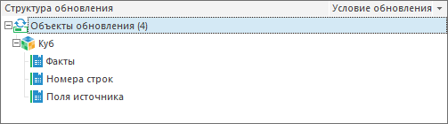

# Стандартные кубы

Стандартные кубы
-

# Стандартные кубы

При [добавлении в обновление](../Admin_CreateUpdate_AddObjects.htm)
 стандартного куба автоматически добавляются внутренние, дочерние объекты:

Измерения куба добавляются отдельно.

См. также:

[Добавление объектов репозитория](../Admin_CreateUpdate_AddObjects.htm)

		Справочная
		 система на версию 10.9
		 от 18/08/2025,
		 © ООО «ФОРСАЙТ»,
