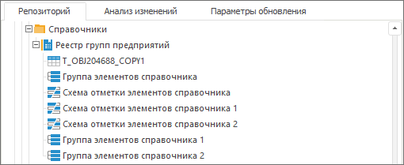

# Схемы отметки

Схемы отметки
-

# Схемы отметки

Схемы отметки можно добавить в обновление:

	- как дочерние элементы справочника, если для добавленных в обновление
	 [справочников](UiNavObj.chm::/reference_book/Create.htm)
	 (в том числе, справочников НСИ) были настроены [схемы
	 отметки](UiNavObj.chm::/reference_book/look-and-feel_Reference_book/UiMd_reference_book_look-and-feel_Scheme.htm);

	- как отдельные объекты справочника.

Примечание.
 Добавление схемы отметки в обновление доступно только в настольном приложении.

На вкладке «[Репозиторий](../Admin_CreateUpdate_AddObjects.htm#repository)»
 около измерения будет отображаться экспандер ( + или - ), если у измерения
 есть схемы отметки:

После [добавления в обновление](../Admin_CreateUpdate_AddObjects.htm)
 схемы отметки отобразятся в [структуре
 обновления](../../Admin_UpMBObj_RunManager.htm).

См. также:

[Добавление объектов репозитория](../Admin_CreateUpdate_AddObjects.htm)

		Справочная
		 система на версию 10.9
		 от 18/08/2025,
		 © ООО «ФОРСАЙТ»,
