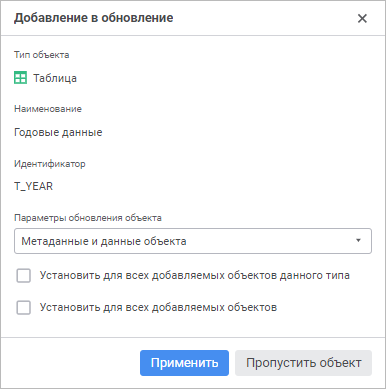

# Табличные наборы данных, справочники НСИ, составные справочники НСИ, автоматические кубы и базы данных временных рядов

Табличные наборы данных, справочники НСИ, составные справочники НСИ, автоматические кубы и базы данных временных рядов
-

# Табличные наборы данных, справочники НСИ, составные справочники НСИ,
 автоматические кубы и базы данных временных рядов

При [добавлении в обновление](../Admin_CreateUpdate_AddObjects.htm)
 табличных наборов данных ([таблицы](UiNavObj.chm::/Table/UiDb_relational_table.htm),
 [присоединенной
 таблицы](UiNavObj.chm::/Attach_table/UiDb_relational_AttachTable.htm), [журнала](UiNavObj.chm::/journal/UiDb_relational_journal.htm)),
 [справочника
 НСИ](UiNavObj.chm::/reference_book/Master_RDS_reference_book/Master_RDS.htm), [составного
 справочника НСИ](UiNavObj.chm::/reference_book/Master_Composite_Table_reference_book/Master_CompositeTable.htm), [автоматического
 куба](UiNavObj.chm::/Cube/CreateCube/Master_Auto/UiMd_Cube_CreateCube_Master_Auto.htm) или [базы
 данных временных рядов](UiNavObj.chm::/TimeSeriesDatabase/CreateTimeSeriesDatabase.htm) будет открыто окно «Добавление
 в обновление»:

В верхней части окна выводится тип добавляемого объекта, наименование
 и идентификатор.

Задайте параметры обновления объекта:

	- выберите в раскрывающемся списке способ обновления объекта:

		- Метаданные и данные объекта.
		 Обновление структуры и данных объекта;

		- Метаданные объекта.
		 Обновление структуры объекта;

		- Данные объекта.
		 Обновление данных объекта;

	- установите флажки при необходимости, если было выбрано несколько
	 объектов для добавления в структуру обновления:

		- Установить для всех добавляемых
		 объектов данного типа. При установленном флажке появляется
		 возможность использовать указанные способы обновления и обработки
		 ограничений целостности для всех объектов указанного типа;

		- Установить для всех добавляемых
		 объектов. При установленном флажке доступны указанные способы
		 обновления и обработки ограничений целостности для всех добавляемых
		 объектов.

## Частичное обновление объектов

В обновление можно добавить поля/отдельные записи таблицы и элементы/атрибуты
 справочника НСИ и составного справочника НСИ.

Для добавления полей/отдельных записей таблицы и элементов/атрибутов
 справочника НСИ в обновление используйте свойства [IMetabaseUpdateDataObjectNode.PrimaryKeysOnly](kesom.chm::/interface/imetabaseupdatedataobjectnode/imetabaseupdatedataobjectnode.primarykeysonly.htm),
 [IMetabaseUpdateDataObjectNode.FieldsOnly](kesom.chm::/interface/imetabaseupdatedataobjectnode/imetabaseupdatedataobjectnode.fieldsonly.htm).
 После чего объект будет добавлен в обновление.

Для определения признака частичного обновления объекта в столбце «Перенос данных» отображается значение
 «Частичный»:

	- в веб-приложении при открытии готового обновления;

	- в настольном приложении при создании и открытии обновления.

В веб-приложении и настольном приложении доступны альтернативные способы
 добавления элементов/атрибутов справочника НСИ и составного справочника
 НСИ в обновление:

[Добавление
 атрибута справочника в обновление](javascript:TextPopup(this))

	Для добавления атрибута справочника НСИ в обновление:

		- Откройте справочник НСИ на редактирование и перейдите на
		 вкладку «Описание». Затем
		 перейдите на вкладку «Атрибуты».

		- Вызовите контекстное меню выбранного атрибута.

		- Выберите пункт «Добавить
		 в обновление».

		- Если ранее справочник еще не был включен в обновление, будет
		 открыто окно «Добавление в обновление».
		 Задайте в нём параметры обновления. Если ранее справочник уже
		 был включен в обновление, при добавлении новых атрибутов
		 настраивать параметры повторно не нужно.

	В результате выполненных действий в структуру обновления в менеджере
	 обновлений будет добавлен выбранный атрибут.

[Удаление
 атрибута справочника из обновления](javascript:TextPopup(this))

	Для удаления атрибута справочника НСИ из обновления:

		- Откройте справочник НСИ на редактирование и перейдите на
		 вкладку «Описание». Затем
		 перейдите на вкладку «Атрибуты».

		- Вызовите контекстное меню выбранного атрибута.

		- Выберите пункт «Убрать
		 из обновления».

	В результате выполненных действий выбранный атрибут будет исключён
	 из структуры обновления.

[Добавление
 элемента справочника в обновление](javascript:TextPopup(this))

	Для добавления элемента справочника НСИ в обновление в веб-приложении:

		- Откройте справочник НСИ на редактирование.

		- Выполните команду «Добавить
		 в обновление» в контекстном меню выбранного элемента.

	В результате выполненных действий в состав обновления в менеджере
	 обновлений будет добавлен выбранный элемент.

	Для добавления элемента справочника НСИ в обновление в настольном
	 приложении:

		- Откройте справочник НСИ на редактирование и перейдите на
		 вкладку «Элементы справочника».

		- Вызовите контекстное меню выбранного элемента.

		- Следующий шаг зависит от наличия дочерних элементов:

			- если выбранный элемент не имеет дочерних элементов,
			 выберите пункт «Добавить
			 в обновление»;

			- если выбранный элемент имеет дочерние элементы, выберите
			 пункт «Добавить в обновление»,
			 затем в раскрывшемся списке выберите:

				- Без дочерних элементов.
				 Элемент будет добавлен в обновление без дочерних элементов;

				- С дочерними элементами.
				 Элемент будет добавлен в обновление вместе с дочерними
				 элементами.

		- Если ранее справочник еще не был включен в обновление, будет
		 открыто окно «Добавление в обновление».
		 Задайте в нём параметры обновления. Если ранее справочник уже
		 был включен в обновление, при добавлении новых элементов настраивать
		 параметры повторно не нужно.

	В результате выполненных действий в состав обновления в менеджере
	 обновлений будет добавлен выбранный элемент.

[Удаление
 элемента справочника из обновления](javascript:TextPopup(this))

	Для удаления элемента справочника НСИ из обновления в веб-приложении:

		- Откройте справочник НСИ на редактирование.

		- Выполните команду «Удалиь
		 из обновления» в контекстном меню выбранного элемента.

	В результате выполненных действий выбранный элемент будет исключён
	 из структуры обновления.

	Для удаления элемента справочника НСИ из обновления в настольном
	 приложении:

		- Откройте справочник НСИ на редактирование и перейдите на
		 вкладку «Элементы справочника».

		- Вызовите контекстное меню выбранного элемента.

		- Выберите пункт «Убрать
		 из обновления».

	Примечание.
	 Если из обновления удален родительский элемент, его дочерние элементы
	 останутся в обновлении. Для удаления дочерних элементов из обновления
	 выполните команду «Убрать из обновления»
	 в контекстном меню дочерних элементов.

	В результате выполненных действий выбранный элемент будет исключён
	 из структуры обновления.

## Особенности обновления базы данных временных рядов

Для корректного обновления метаданных базы данных временных рядов:

	- Добавьте базу данных временных рядов в [обновление](../Admin_CreateUpdate_AddObjects.htm).

	- Выполните настройку обновления базы данных временных рядов,
	 используя [Fore](KeSom.chm::/Interface/IMetabaseUpdateDataObjectNode/IMetabaseUpdateDataObjectNode.AllowExistingRubricatorUpdate.htm).

	- Выполните [сохранение
	 обновления](../../SaveUpdate/Admin_SaveUpdate.htm).

В зависимости от значения, установленного в параметре «[Предварительная
 очистка объектов, зависимых по содержимому](../../Admin_UpMBObj_OBJUpdateParameters.htm#pre-cleaning)» для корневого элемента
 «Объекты обновления», при обновлении
 базы данных временных рядов будут обновляться различные метаданные:

	- без предварительной очистки:

		- неидентифицирующие атрибуты, не обязательные для заполнения
		 (только добавление и удаление);

		- неуникальные индексы;

	- с предварительной очисткой:

		- идентифицирующие атрибуты;

		- неидентифицирующие атрибуты, обязательные для заполнения;

		- изменение типа данных атрибута;

		- уникальные индексы;

		- правила формирования мнемоник.

См. также:

[Добавление объектов репозитория](../Admin_CreateUpdate_AddObjects.htm)

		Справочная
		 система на версию 10.9
		 от 18/08/2025,
		 © ООО «ФОРСАЙТ»,
