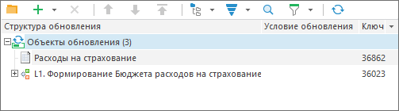

# Объекты полномочий и бизнес-процессы

Объекты полномочий и бизнес-процессы
-

# Объекты полномочий и бизнес-процессы

Для сохранения целостности данных при переносе объектов полномочий и
 процессов между репозиториями выполните следующие действия:

	- Пересохраните процесс на сборке 9.2.485 U7 или выше. Действие
	 требуется для сохранения [отметки
	 объекта полномочий](BPM.chm::/Desktop/Facility_Agreement/Configuring_the_Authorization_Object.htm), которая была настроена в бизнес-процессе.

	- Добавьте в обновление объект полномочий, который связан с процессом.

	- Добавьте процесс в обновление:

	- Добавьте модуль обновления процессов с идентификатором MOD_UPDATE_B_PROCESS,
	 затем внутри обновления вызовите контекстное меню модуля и объявите
	 его [модулем обновления](Admin_CreateUpdate_Features_Module.htm).

	- Установите флажок «[Делать
	 пользователя подключаемым с сервера, если он существует на уровне
	 СУБД](../../UpdateProcess_Parameters.htm#when_creating_update)» для сохранения роли ответственного, которая была
	 настроена в шагах бизнес-процесса «[Ввод данных](BPM.chm::/Desktop/Process/StepsProcess/Data_Entry.htm)»
	 и «[Согласование](BPM.chm::/Desktop/Process/StepsProcess/Agreement.htm)».

Примечание.
 Если при создании файла обновления не был использован модуль обновления
 процессов, после [установки
 обновления](../../Admin_UpMBObj_DoUpdate.htm) выполните [служебные
 задачи](BPM.chm::/Desktop/Process/Creating_service_tasks.htm) для сохранения целостности данных.

См. также:

[Добавление объектов репозитория](../Admin_CreateUpdate_AddObjects.htm)
 | [Создание
 служебных задач для бизнес-процессов](BPM.chm::/Desktop/Process/Creating_service_tasks.htm)

		Справочная
		 система на версию 10.9
		 от 18/08/2025,
		 © ООО «ФОРСАЙТ»,
