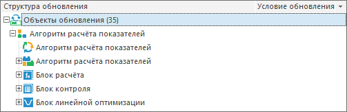

# Алгоритмы расчёта показателей

Алгоритмы расчёта показателей
-

# Алгоритмы расчёта показателей

При [добавлении в обновление](../Admin_CreateUpdate_AddObjects.htm)
 алгоритма расчёта показателей дочерние объекты автоматически добавляются
 в обновление.

Дочерние объекты располагаются в структуре обновления после самого алгоритма
 расчёта:

См. также:

[Добавление объектов репозитория](../Admin_CreateUpdate_AddObjects.htm)

		Справочная
		 система на версию 10.9
		 от 18/08/2025,
		 © ООО «ФОРСАЙТ»,
