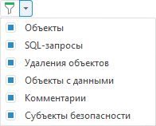

# Фильтрация объектов обновления

Фильтрация объектов обновления
-

# Фильтрация объектов обновления

Для фильтрации объектов обновления в настольном приложении:

	- Нажмите кнопку 
	 «Включить/выключить фильтрацию»
	 на панели инструментов.

	- Установите/снимите флажок напротив объекта обновления в раскрывающемся
	 списке:

После выполнения действий в структуре обновления будут отфильтрованы
 объекты обновления в соответствии с установленными флажками.

См. также:

[Создание обновления](Admin_CreateUpdate.htm)

		Справочная
		 система на версию 10.9
		 от 18/08/2025,
		 © ООО «ФОРСАЙТ»,
