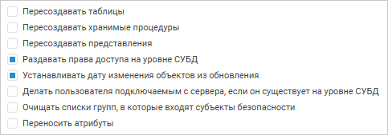
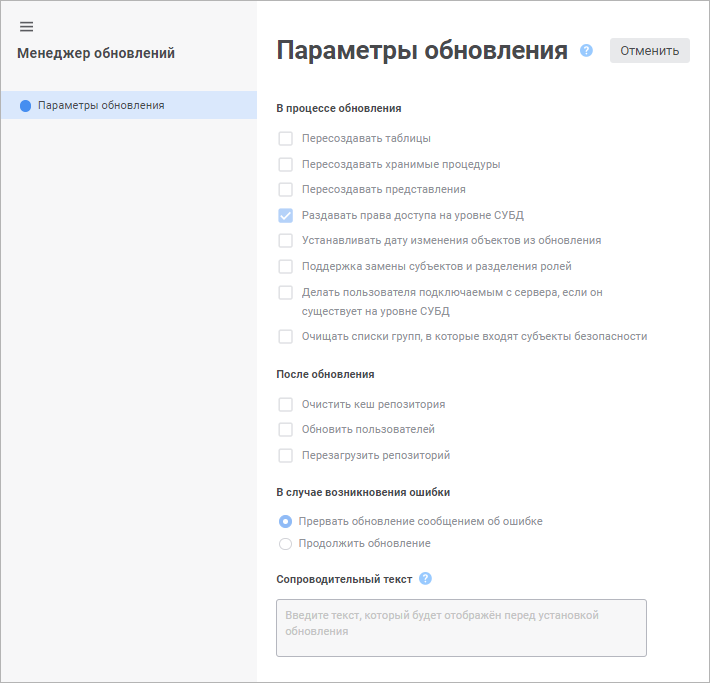

# Настройка параметров процесса обновления

Настройка параметров процесса обновления
-
-

# Настройка параметров процесса обновления

Для настройки параметров процесса обновления используйте [панель
 параметров обновления](Admin_UpMBObj_RunManager.htm) в веб-приложении или вкладку «[Параметры обновления](Admin_UpMBObj_RunManager.htm)»
 в настольном приложении. Настроенные параметры обновления сохраняются
 для текущего пользователя и автоматически применяются при создании нового
 обновления.

При открытии готового обновления в веб-приложении доступен только просмотр
 настроенных параметров обновления в мастере менеджера обновлений. Для
 открытия мастера менеджера обновлений нажмите кнопку 
 «Настройки» в главном меню.

	 Мастер обновлений Мастер менеджера обновлений в веб-приложении Менеджер обновлений в настольном приложении

		

		

		

Для редактируемого обновления настройте
 параметры:

[В
 процессе обновления](javascript:TextPopup(this))

	В группе «В процессе обновления»
	 определяются действия, которые будут выполнены при установке обновления:

		- Пересоздавать таблицы.
		 При установке флажка таблицы будут пересоздаваться на уровне СУБД.
		 При снятом флажке таблицы пересоздаются на уровне репозитория;

	Примечание.
	 Если структура таблицы изменена, например, добавлены или удалены [поля](uinavobj.chm::/Table/Master/UiDb_relational_table_master_field.htm),
	 то для обновления таблицы в целевом репозитории должен быть установлен
	 флажок «Пересоздавать таблицы».

		- Пересоздавать хранимые
		 процедуры. При установке флажка процедуры будут пересоздаваться
		 на уровне СУБД. Когда флажок снят, процедуры не пересоздаются;

		- Пересоздавать представления.
		 При установке флажка представления будут пересоздаваться на уровне
		 СУБД. Когда флажок снят, представления не пересоздаются;

	Примечание.
	 Для конкретного объекта обновления можно задать уникальные настройки
	 по пересозданию, воспользовавшись для него пунктом «[Пересоздавать при
	 обновлении](Admin_UpMBObj_OBJUpdateParameters.htm#re-create_at_update)» в параметрах
	 обновления объекта.

		- Раздавать права доступа
		 на уровне СУБД. Если в обновлении был настроен [перенос
		 прав доступа](Admin_UpMBObj_OBJUpdateParameters.htm) для одного или нескольких объектов, то возможно
		 потребуется обновление прав доступа на уровне СУБД. Установка
		 флажка позволяет при [установке
		 обновления](Admin_UpMBObj_DoUpdate.htm) сообщить об этом и при положительном ответе произвести
		 обновление прав доступа на уровне СУБД. При снятом флажке при
		 установке обновления права будут применены только на уровне платформы,
		 для применения прав доступа на уровне СУБД необходимо будет произвести
		 обновление пользователей;

		- Устанавливать дату изменения
		 объектов из обновления. По умолчанию флажок снят. После
		 установки обновления даты изменения объектов, содержащихся в обновлении,
		 будут соответствовать дате установке обновления. При установленном
		 флажке даты изменения обновляемых объектов будут соответствовать
		 реальным датам изменения объектов в репозитории на момент формирования
		 обновления;

		- Поддержка замены субъектов
		 и разделения ролей. По умолчанию опция включена. Данный
		 флажок определяет поведение при необходимости замены субъектов
		 и разделения ролей в процессе создания обновления. Параметр сохраняется
		 в файле обновления;

	Примечание.
	 Действие доступно только в настольном приложении.

		- Делать пользователя подключаемым
		 с сервера, если он существует на уровне СУБД. Установите
		 флажок, если в обновлении содержится:

			- Процесс. Действие
			 требуется для сохранения роли ответственного, которая была
			 настроена в шагах [бизнес-процесса](bpm.chm::/Modeling_of_business_processes.htm)
			 «Ввод данных» и «Согласование»;

			- Субъект безопасности.
			 Действие требуется при переносе [отдельных
			 пользователей](Admin.chm::/03_Admin/Users/Admin_Users.htm)
			 между репозиториями. Установите флажок для корректного переноса
			 пользователей на сервер базы данных. В этом случае при [установке обновления](Admin_UpMBObj_DoUpdate.htm)
			 новый пользователь не создаётся, если он уже существует на
			 сервере. Если флажок не установлен, то на сервере будет создаваться
			 новый пользователь. В случае, если данный пользователь уже
			 существует, появляется соответствующая ошибка;

		- Очищать списки групп, в
		 которые входят субъекты безопасности. По умолчанию опция
		 выключена. Данный флажок определяет, будут ли очищаться списки
		 групп, в которые входят субъекты безопасности, в целевом репозитории
		 при установке обновления. Например, если в исходном репозитории
		 субъект входит в группу А, а в целевом репозитории - в группу
		 Б, то после применения обновления в целевом репозитории субъект
		 будет входить только в группу А. Если флажок снят, то после применения
		 обновления в целевом репозитории субъект будет входить в группу
		 А и Б.

	Примечание.
	 Действие доступно, если в обновлении добавлен хотя бы один [субъект
	 безопасности](CreateUpdate/Admin_CreateUpdate_AddUser.htm), для которого задан параметр «[Переносить
	 членство в группах](Admin_UpMBObj_OBJUpdateParameters.htm#transfer_group_memberships)» со значением «Да».

		- Переносить атрибуты.
		 Установите флажок для добавления всех [пользовательских
		 атрибутов](admin.chm::/04_SecurityPolicy/Creating_attributes.htm) пользователей, групп пользователей,
		 классов объектов и отдельных типов объектов в обновление. Пользовательские
		 атрибуты используются при настройке [атрибутного
		 метода разграничения доступа](Admin.chm::/04_SecurityPolicy/Admin_ABAC.htm).

	Особенности переноса атрибутов:

			- если идентификатор и тип данных переносимого атрибута
			 совпадает с идентификатором и типом данных обновляемого атрибута,
			 то будет перенесено только значение атрибута;

			- если идентификатор переносимого атрибута совпадает с
			 идентификатором обновляемого атрибута, но типы данных отличаются,
			 то установка обновления будет прервана;

			- если идентификатор переносимого атрибута отличается
			 от идентификаторов обновляемых атрибутов, то будет добавлен
			 новый атрибут.

	По умолчанию флажок снят, пользовательские
	 атрибуты не переносятся.

	Примечание.
	 Действие «Переносить атрибуты»
	 доступно только в веб-приложении. В настольном приложении используйте
	 свойство [IMetabaseUpdate.IncludeAbacAttributes](kesom.chm::/interface/imetabaseupdate/imetabaseupdate.includeabacattributes.htm).

[После
 обновления](javascript:TextPopup(this))

	В группе «После обновления»
	 определяются действия, которые будут выполнены после установки обновления.
	 Список выбранных действий будет отображен на заключительной странице
	 мастера установки обновления:

		- Очистить кеш репозитория.
		 Очищает кеш репозитория и кеш сборок продукта «Форсайт. Аналитическая платформа»,
		 которые хранятся на сервере;

		- Обновить пользователей.
		 Данная операция необходима, когда нельзя использовать перенос
		 прав из-за отличия списков пользователей схемы-приёмника и схемы-источника
		 (или отличия прав), потому что будут перенесены права со схемы,
		 где был создан файл обновления;

		- Перезагрузить репозиторий.
		 Данная операция необходима, если в момент обновления были открыты
		 обновляемые объекты. При выполнении операции будут закрыты все
		 объекты репозитория и автоматически открыто окно подключения к
		 репозиторию.

[В
 случае возникновения ошибки](javascript:TextPopup(this))

	В группе «В случае возникновения
	 ошибки» определяется действие при возникновении ошибки обновления:

		- Прервать обновление сообщением
		 об ошибке. При возникновении ошибки в процессе обновления
		 будет выдано сообщение об ошибке, обновление будет прервано. По
		 умолчанию установлен данный вариант;

		- Продолжить обновление.
		 При возникновении ошибки обновление будет продолжено без выдачи
		 сообщений. Исключением являются ошибки о невозможности обновления
		 объекта. В данном случае все равно появится сообщение. Продолжить
		 обновление будет можно, только отреагировав на сообщение.

[Сопроводительный
 текст](javascript:TextPopup(this))

	Заданный текст будет отображен в [мастере
	 установки обновления](Admin_UpdateVersion.htm).

[Метаданные](javascript:TextPopup(this))

	В группе «Метаданные» при
	 [сохранении обновления](SaveUpdate/Admin_SaveUpdate.htm)
	 определяются:

		- автор;

		- дата и время создания;

		- имя рабочей станции;

		- версия платформы.

Примечание.
 В веб-приложении доступна только часть параметров из группы «В
 процессе обновления».

См. также:

[Создание
 обновления](CreateUpdate/Admin_CreateUpdate.htm) | [Анализ изменений
 объектов](Admin_UpMBObj_ChangeAnalysis.htm)

		Справочная
		 система на версию 10.9
		 от 18/08/2025,
		 © ООО «ФОРСАЙТ»,
