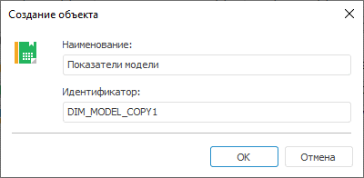

# Объекты обновления

Объекты обновления
-

# Объекты обновления

На вкладке «Объекты обновления»
 страницы «[Информация](Admin_UpMBObj_DoUpdateFile.htm)»
 отображается список элементов обновления:

	- объекты репозитория, имеющиеся в обновлении, и информация о
	 них (наименование, идентификатор, ключ, способ обновления);

	- прочие элементы обновления без дополнительной информации.

	Веб-приложение. Установка обновления *.pefx Веб-приложение. Установка обновления *.updpack Настольное приложение

		

		

		

Примечание.
 Удаления объектов отображаются в списке, если в схеме-приёмнике есть соответствующие
 объекты, и не отображаются, если таких объектов нет.

Для объектов доступно контекстное меню:

	- Создать копию
	 объекта. Позволяет создать в репозитории копию объекта, а не
	 обновлять исходный объект. При выполнении данной команды откроется
	 диалог задания наименования и идентификатора объекта:

По умолчанию поля заполнены:

		- Имя объекта берется из обновления;

		- Идентификатор генерируется с
		 учётом [формата
		 идентификаторов](Admin.chm::/04_SecurityPolicy/Editor_of_Politicy/Security_EditorPoliticy_General.htm), заданного в менеджере безопасности,
		 и идентификатора объекта из обновления.

Объекты, для которых таким образом были изменены
 данные, будут выделены жирным шрифтом в списке.

Примечание.
 Создание копии объекта доступно только в настольном приложении.

	- Показать в навигаторе объектов.
	 Команда показывает выбранный объект в навигаторе объектов репозитория.
	 При попытке перейти к объекту, который отсутствует в репозитории,
	 будет выдано сообщение о том, что объект не найден.

Примечание.
 Просмотр объекта в навигаторе объектов доступен только в настольном приложении.

См. также:

[Процесс
 обновления](Admin_UpMBObj_DoUpdateFile.htm) | [Субъекты обновления](Update_subjects.htm)

		Справочная
		 система на версию 10.9
		 от 18/08/2025,
		 © ООО «ФОРСАЙТ»,
