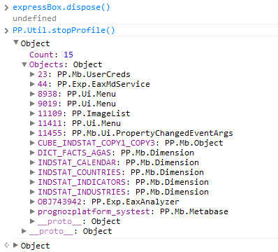

# Поиск неудалённых объектов

Поиск неудалённых объектов
-

# Поиск неудалённых объектов

## Проблема

Во избежание утечек памяти при использовании компонентов продукта «Форсайт. Аналитическая платформа»,
 ненужным объектам нужно вызывать метод dispose.

Однако, при разработке можно забыть, какие объекты создавались и не
 удалялись.

## Решение

Для отслеживания неудалённых объектов используется функции PP.Util.startProfile
 и PP.Ui.Util.stopProfile:

	- Вызовите метод PP.Util.startProfile()
	 в начале кода страницы;

	- После выполнения кода
	 по созданию компонентов «Форсайт. Аналитическая платформа»
	 вызовите метод dispose;

	- Вызовите метод PP.Ui.Util.stopProfile
	 из консоли:

См. также:

[База
 знаний разработчиков веб-приложений](Web_Developers_KnowledgeBase.htm)

		Справочная
		 система на версию 10.9
		 от 18/08/2025,
		 © ООО «ФОРСАЙТ»,
