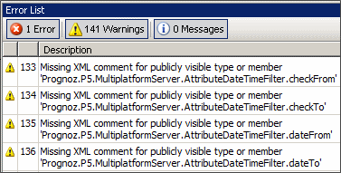
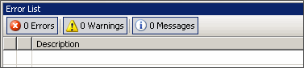

# Предупреждения (Warnings) при сборке проекта

Предупреждения (Warnings) при сборке проекта
-

# Предупреждения (Warnings) при сборке проекта

## Проблема

Примечание.
 Разработка ведется в среде Visual
 Studio 2008.

При сборке проекта часто возникают предупреждения (Warnings), которые
 не влияют на работу программы:

Они предупреждают о потенциальных проблемах различного характера, которые
 могут возникнуть.

## Решение

Необходимо изменить код таким образом, чтобы количество предупреждений
 было равно нулю. Это позволит избежать потенциальных проблем.

См. также:

[База
 знаний разработчиков веб-приложений](Web_Developers_KnowledgeBase.htm)

		Справочная
		 система на версию 10.9
		 от 18/08/2025,
		 © ООО «ФОРСАЙТ»,
