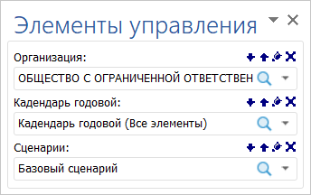

# Использование интерактивных элементов управления данными: Foresight Add-in for Word

Использование интерактивных элементов управления данными: Foresight Add-in for Word
-

# Использование интерактивных элементов управления данными

Управление данными, отображаемыми объектами отчёта, выполняется с помощью
 элементов управления.

При добавлении в документ отчёта из репозитория с настроенными элементами
 управления, они будут отображены на панели «Элементы
 управления».

[При добавлении
 экспресс-отчёта](javascript:TextPopup(this))

	При добавлении экспресс-отчёта, содержащего фиксированные измерения,
	 в документ, в качестве элемента управления выступает заголовок. Для
	 отображения/скрытия панели «Заголовок»
	 используйте кнопку  «Заголовок»
	 на вкладке «FORESIGHT»
	 ленты инструментов. Заголовок отображается как гиперссылка, при нажатии
	 на которую открывается иерархический список для выбора элемента фиксированного
	 измерения. Изменения вступают в силу после [обновления](../ObjectsWork.htm#common).

При добавлении объектов отчёта элемент управления настраивается на определенное
 измерение источника данных объекта. В результате, элемент управления отображает
 элементы выбранного измерения в виде раскрывающегося списка. Изменения
 в отметке элементов измерения влияют на данные, отображаемые объектом.

[Создание элемента
 управления](javascript:TextPopup(this))

	Для создания элемента управления используйте панель «Объекты отчета»:

		- Убедитесь, что панель отображается.

		- Выберите измерение объекта, для которого создается элемент
		 управления.

		- Выполните одно из действий:

		-

			- выполните команду контекстного меню «Создать
			 элемент управления» для измерения;

			- перетащите измерение на панель «Элементы
			 управления», используя механизм Drag&Drop.

	После выполнения последовательности действий будет создан элемент
	 управления. Наименование и отметка элементов в созданном элементе
	 управления совпадают с наименованием и отметкой элементов в управляемом
	 измерении.

Для работы с элементами управления используйте панель «Элементы
 управления»:

Для отображения/скрытия панели используйте кнопку 
 «Элементы управления», расположенной
 в группе «Вид» на вкладке «Foresight»
 ленты инструментов.

Примечание.
 Отображение панели недоступно, если в отчете отсутствуют объекты.

Операции, доступные с элементами управления:

[Поиск элементов](javascript:TextPopup(this))

	Для поиска элементов измерения нажмите кнопку 
	 «Поиск».

[Изменение отметки
 элементов](javascript:TextPopup(this))

	Для работы с отметкой элементов измерения используйте команды контекстного
	 меню, описанные в разделе «[Изменение отметки в справочниках](uireport.chm::/desktop/Source/Dim/UiReport_Dim_Change_mark.htm)».

[Управление отметкой
 в нескольких объектах (синхронизация отметки)](javascript:TextPopup(this))

	Один элемент управления может управлять отметкой в одинаковых измерениях
	 в нескольких объектах отчета. Для этого настройте синхронизацию отметки
	 измерений:

		- Создайте элемент управления для требуемого измерения одного
		 из объектов.

		- В другом объекте выделите элемент, соответствующий данному
		 измерению, и выполните команду «Значение
		 из элемента управления» в контекстном меню. Будет отображен
		 список всех доступных элементов управления, в котором укажите
		 требуемый элемент.

	В результате, созданный элемент управления влияет на отметку элементов
	 в обоих блоках.

[Отвязка объекта
 от элемента управления](javascript:TextPopup(this))

	Для отвязки элемента от объекта управления:

		- На странице выберите объект, который требуется отвязать
		 от элемента управления.

		- Выполните команду «Удалить
		 элемент управления содержимым» в контекстном меню объекта.

	Объект будет отвязан от всех элементов управления.

При изменении значения элемента управления данные в документе обновляются
 в соответствии с измененным значением.

См. также:

[Построение
 отчёта с использованием надстройки](../Word_Work.htm)

		Справочная
		 система на версию 10.9
		 от 18/08/2025,
		 © ООО «ФОРСАЙТ»,
