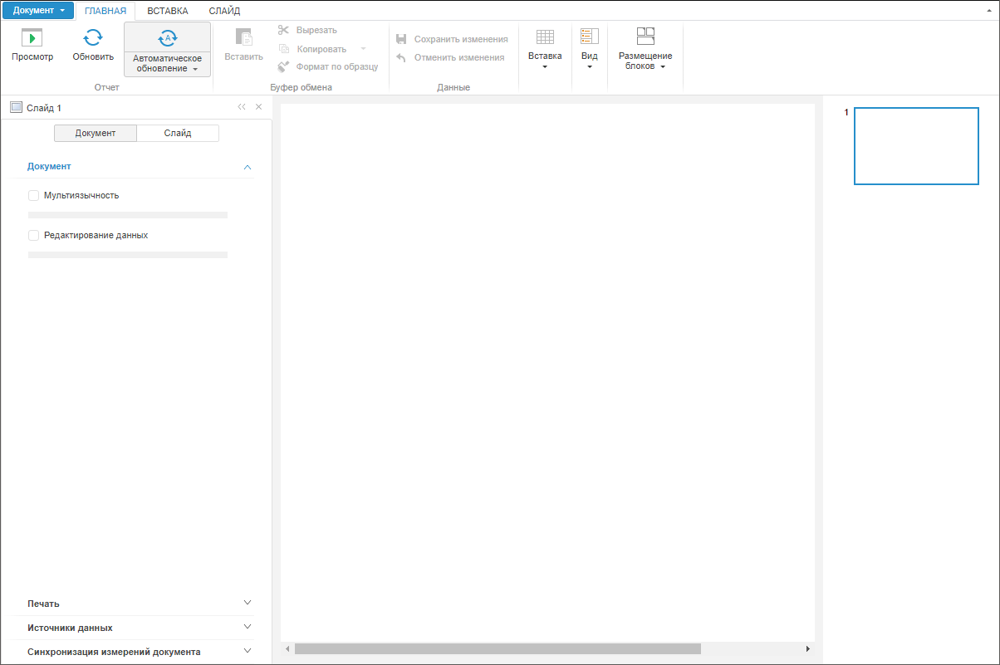
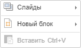

# Конструктор KapBox

Конструктор KapBox
-

# Конструктор KapBox

## Синтаксис

Kap.KapBox({

    settings

});

## Параметры

settings. JSON-объект с параметрами,
 применяющимися при создании компонента [KapBox](../../Components/KapBox/KapBox.htm).

Доступны следующие параметры:

		 Имя параметра
		 Тип
		 Краткое описание

		 Обязательные
		 параметры:

		 Metabase
		 [PP.Mb.Metabase](dhtmlMetabase.chm::/Classes/Metabase/Metabase/Metabase.htm)
		 Репозиторий, к которому будет осуществляться подключение.

		 ParentNode
		 string
		 DOM-вершина, в которой будет размещаться компонент.

		 Необязательные
		 параметры:

		 BlockExportControl
		 boolean
		 Определяет доступность [экспорта блока](UIAdhoc.chm::/Document/Export.htm)
		 в файл:

			- true. По умолчанию.
			 Экспорт блока в файл доступен;

			- false. Экспорт
			 блока в файл недоступен.

		 BlockFocused
		 function
		 Возвратная функция, которая вызывается при выделении блока.

		 BlockLinkControl
		 boolean
		 Определяет отображение кнопки «[Ссылка на блок](UiAdhoc.chm::/Work/InteractiveElements.htm)» в раскрывающемся меню уголка блока:

			- true. По умолчанию.
			 Кнопка отображается, если параметр Embed принимает значение
			 true;

			- false. Кнопка
			 не отображается.

		 BlockMaximizeMinimizeControl
		 boolean
		 Определяет доступность [сворачивания
		 и разворачивания блока](UiAdhoc.chm::/Work/InteractiveElements.htm):

			- true. По умолчанию.
			 Сворачивание и разворачивание блока доступно;

			- false. Сворачивание
			 и разворачивание блока недоступно.

		 BlockPrintControl
		 boolean
		 Определяет доступность [печати блока](UiAdhoc.chm::/Work/InteractiveElements.htm)
		 без предварительного просмотра:

			- true. По умолчанию.
			 Печать блока доступна;

			- false. Печать
			 блока недоступна.

		 BlockSettingsControl
		 boolean
		 Определяет доступность [настройки визуализатора](UiAdhoc.chm::/Work/InteractiveElements.htm) в блоке:

			- true. По умолчанию.
			 Настройка визуализатора доступна;

			- false. Настройка
			 визуализатора недоступна.

		 BlockShowDataControl
		 boolean
		 Определяет доступность [отображения
		 данных](UiAdhoc.chm::/Work/InteractiveElements.htm), на основании которых строится блок:

			- true. По умолчанию.
			 Отображение данных доступно;

			- false. Отображение
			 данных недоступно.

		 CMCorner2XSIZE
		 boolean
		 Определяет размер пиктограммы уголка блока:

			- true. По умолчанию.
			 Пиктограмма уголка отображается в стандартном размере;

			- false. Пиктограмма
			 уголка отображается в двойном размере.

		 Collaboration
		 boolean
		 Определяет доступность
		 вкладки боковой панели «Совместная
		 работа»:

			- true. По умолчанию.
			 Вкладка доступна;

			- false. Вкладка
			 недоступна.

		 ContextMenu
		 function
		 Возвратная функция, которая вызывается перед отображением контекстного
		 меню.

		 Embed
		 boolean
		 Определяет доступность получения [ссылки на блок](UiAdhoc.chm::/Work/InteractiveElements.htm):

			- true. Получение
			 ссылки доступно;

			- false. По умолчанию.
			 Получение ссылки недоступно.

		 ExpressReport
		 boolean
		 Определяет доступность [вставки
		 экспресс-отчёта](UIAdhoc.chm::/Blocks/Reports/Express_Report.htm) в блок:

			- true. Экспресс-отчёт
			 доступен для вставки в блок;

			- false. По умолчанию.
			 Экспресс-отчёт недоступен для вставки в блок.

		 HTMLBlock
		 boolean
		 Определяет доступность [вставки HTML-блока](UIAdhoc.chm::/Blocks/Other/html_link.htm):

			- true. По умолчанию.
			 HTML-блок доступен для вставки;

			- false. HTML-блок
			 недоступен для вставки.

		 ImagePath
		 string
		 Путь до папки с файлами изображений веб-приложения - «../build/img».

		 Inited
		 function
		 Возвратная функция, которая вызывается после инициализации
		 компонента.

		 Key
		 number
		 Ключ аналитической панели.

		 Mode
		 string
		 Режим открытия аналитической панели:

			- edit. Редактирование;

			- view. Просмотр.

		 Moniker
		 string
		 Моникёр открытой аналитической панели.

		 Opened
		 function
		 Возвратная функция, которая вызывается при открытии аналитической
		 панели.

		 RegularReport
		 boolean
		 Определяет доступность [вставки
		 регламентного отчёта](UIAdhoc.chm::/Blocks/Reports/Procedural_report.htm) в блок:

			- true. По умолчанию.
			 Регламентный отчёт доступен для вставки в блок;

			- false. Регламентный
			 отчёт недоступен для вставки в блок.

		 Rendered
		 function
		 Возвратная функция, которая вызывается при отрисовке аналитической
		 панели.

		 ResourcesPath
		 string
		 Путь до папки с ресурсами веб-приложения - «../resources».

		 Saved
		 function
		 Возвратная функция, которая вызывается при сохранении аналитической
		 панели.

		 ServicesPlugins
		 boolean
		 Определяет отображение [плагинов](UiAdhoc.chm::/Blocks/Plugins/Plugins.htm),
		 зарегистрированных в [сервисах](UiAdhoc.chm::/Blocks/Plugins/Plugins.htm#web):

			- true. Плагины
			 отображаются;

			- false. По умолчанию.
			 Плагины не отображаются.

		 SidePanelEnableResize
		 boolean
		 Определяет доступность изменения размера боковой панели:

			- true. Размер
			 боковой панели доступен для изменения;

			- false. По умолчанию.
			 Размер боковой панели недоступен для изменения.

		 TimeSeries
		 boolean
		 Определяет доступность [вставки временных
		 рядов](UIAdhoc.chm::/Blocks/Reports/TimeSeries.htm) в блок:

			- true. Временные
			 ряды доступны для вставки в блок;

			- false. По умолчанию.
			 Временные ряды недоступны для вставки в блок.

		 ViewModeContextMenuOFF
		 boolean
		 Определяет отображение контекстного меню блоков при открытии
		 аналитической панели на просмотр:

			- true. Контекстное
			 меню не отображается;

			- false. По умолчанию.
			 Контекстное меню отображается.

## Описание

Конструктор KapBox создает экземпляр
 класса [Dashboard](Dashboard.htm).

## Комментарии

Реализует компонент [KapBox](../../Components/KapBox/KapBox.htm)
 для работы с аналитической панелью.

При [подключении
 плагина](UiAdhoc.chm::/Blocks/Plugins/Plugins.htm#serv_reg) к аналитической панели через репозиторий выполняется
 настройка аналитической панели. Для отображения плагина, зарегистрированного
 в сервисах:

	- Задайте свойство Kap.ServicesPlugins
	 со значением True, например:

kapBox = new Kap.KapBox({
    Metabase: metabase,
    ParentNode: "DashboardBox",
    Key: ppKey,
    Mode: ppMode,
    ServicesPlugins: true
});

	- Перезапустите веб-сервер, используемый веб-приложением.

После выполнения действий плагин будет подключен в веб-приложении.

## Пример

Для открытия аналитической панели с помощью конструктора KapBox
 создайте HTML-страницу и выполните код:

<!DOCTYPE html PUBLIC "-//W3C//DTD XHTML 1.0 Transitional//EN" "http://www.w3.org/TR/xhtml1/DTD/xhtml1-transitional.dtd">
<html xmlns="http://www.w3.org/1999/xhtml">
<head>
    <meta http-equiv="X-UA-Compatible" content="IE=edge" />
    <title>KapBox</title>
    
    
    
    
    
    
    <link href="build/PP.css" rel="stylesheet" type="text/css" />
    <link href="build/PP.App.css" rel="stylesheet" type="text/css" />
    <link href="build/PP.Metabase.css" rel="stylesheet" type="text/css" />

    
</head>
<body style="height: 100%;">
    

    

</body>
</html>

Примечание.
 Через функцию onModuleInit() обязательно
 должно осуществиться подключение к базе данных. Функция вызывается до
 создания KapBox и Metabase.

После выполнения примера на странице будет открыт конструктор аналитических
 панелей:

При инициализации, отрисовке и открытии конструктора аналитических панелей
 в консоль браузера будут выводиться соответствующие сообщения.

При щелчке правой кнопкой мыши по рабочей области компонента будет открыто
 меню:

При выделении блока аналитической панели (при переходе фокуса на блок
 аналитической панели) в консоль будет выводиться JSON-объект с параметрами
 выделенного блока.

Примечание.
 Для добавления блока выполните команду контекстного меню рабочей области
 аналитической панели «Новый блок».

См. также:

[KapBox](../../Components/KapBox/KapBox.htm)
 | [Пример размещения
 компонента KapBox](../../Components/KapBox/KapBox_example.htm)

		Справочная
		 система на версию 10.9
		 от 18/08/2025,
		 © ООО «ФОРСАЙТ»,
