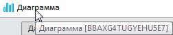

# Dashboard.getBlock

Dashboard.getBlock
-

# Dashboard.getBlock

## Синтаксис

getBlock(blockKey: String);

## Параметры

blockKey. Ключ аналитической
 панели.

## Описание

Метод getBlock возвращает блок
 аналитической панели по идентификатору.

## Комментарии

Идентификатор блока аналитической панели можно получить одним из способов:

	- с помощью всплывающей подсказки. Выделите блок аналитической
	 панели, перейдите на заголовок боковой панели и наведите курсор на
	 название блока. Появится всплывающая подсказка, содержащая название
	 блока и его идентификатор:

	- с помощью метода [Dashboard.getMeta](Dashboard.getMeta.htm).

## Пример

Для выполнения примера убедитесь, что в репозитории содержится аналитическая
 панель с ключом «88665».

Создайте HTML-страницу с [примером
 размещения компонента KapBox](../../Components/KapBox/KapBox_example.htm) и выполните следующие действия:

	- Откройте аналитическую панель с ключом «88665»:

		- выполните команду «Документ
		 > Открыть» в главном меню;

		- выполните в консоли:

kapBox.open({
    Key: 88665
});

	- Выполните в консоли:

var mdButton = new PP.Ui.Button({
    ParentNode: "but",
    Content: "Идентификатор блока",
    Click: function () {
        var block = kapBox.getMeta().dataSourceObjects.its.it[0]; // объект с идентификатором первого блока
        console.log(block);
    }
});

После выполнения действия будет отображена
 кнопка «Идентификатор блока»,
 при нажатии на которую в консоли отобразится идентификатор первого блока.

	- Выполните в консоли код с указанием полученного идентификатора
	 блока:

var currentblock =  kapBox.getBlock("S3TXUVZY0URZ85XQ");
currentblock.setBlockTitleVisible(true);

После выполнения примера будет получен идентификатор первого блока,
 при указании которого отобразится заголовок блока.

См. также:

[Dashboard](Dashboard.htm)

		Справочная
		 система на версию 10.9
		 от 18/08/2025,
		 © ООО «ФОРСАЙТ»,
