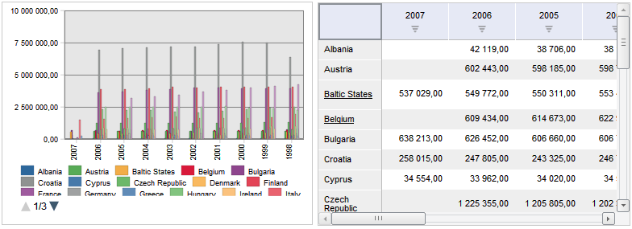
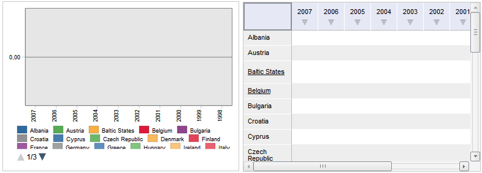

# Dashboard.updateSelection

Dashboard.updateSelection
-

# Dashboard.updateSelection

## Синтаксис

updateSelection();

## Описание

Метод updateSelection обновляет
 отметку элементов измерений в блоках аналитической панели.

## Пример

Для выполнения примера убедитесь, что в репозитории содержится аналитическая
 панель с ключом «88665».

Создайте HTML-страницу с [примером
 размещения компонента KapBox](../../Components/KapBox/KapBox_example.htm) и выполните следующие действия:

	- Откройте аналитическую панель с ключом «88665»:

		- выполните команду «Документ
		 > Открыть» в главном меню;

		- выполните в консоли:

kapBox.open({
    Key: 88665
});

	- Выполните в консоли:

var deSelectAllButton = new PP.Ui.Button({
    ParentNode: "but",
    Content: "Снять отметку",
    Click: function (sender, args) {
        var dimService = new PP.Mb.DimSrv({
            Metabase: metabase
        });
        var dim = new PP.Mb.DimSource({});
        dim.setOdId(kapBox.getMoniker() + "!Sync!1!SEL");
        dimService.getMetadata(dim, function () {
            dimService.deSelectAll(dim, function () {
                kapBox.updateSelection();
             })
         });
    }
});

После выполнения примера будет добавлена кнопка «Снять
 отметку», при нажатии на которую будет снята отметка элементов
 измерения для всех блоков.

Например, аналитическая панель до нажатия на кнопку:

Аналитическая панель после нажатия на кнопку:

См. также:

[Dashboard](Dashboard.htm)

		Справочная
		 система на версию 10.9
		 от 18/08/2025,
		 © ООО «ФОРСАЙТ»,
