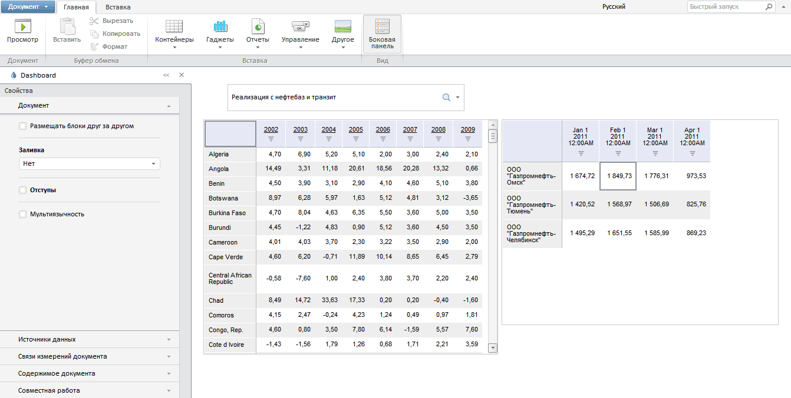

# Пример размещения компонента KapBox

Пример размещения компонента KapBox
-

# Пример размещения компонента KapBox

Перед выполнением примера ознакомьтесь с [рекомендациями](dhtml.chm::/specification/JavaScript_main.htm)
 к написанию кода.

Для работы с аналитическими панелями в теге <head> используется
 ссылка на файл dashboard.nocache.js. Файл содержится в папке dashboard
 (с исполняемыми файлами для аналитических панелей), которая находится
 в одной директории с папкой build (с исходными файлами веб-приложения
 «Форсайт. Аналитическая платформа»).
 Данные папки можно скопировать из корневой папки установленного веб-приложения
 «Форсайт. Аналитическая платформа».

Для создания компонента KapBox
 используйте HTML-код:

<!DOCTYPE html PUBLIC "-//W3C//DTD XHTML 1.0 Transitional//EN" "http://www.w3.org/TR/xhtml1/DTD/xhtml1-transitional.dtd">
<html>
<head>
    <meta http-equiv="X-UA-Compatible" content="IE=edge" />
    <title>KapBox</title>
    
    
    
    
    
    
    <link href="build/PP.css" rel="stylesheet" type="text/css" />
    <link href="build/PP.App.css" rel="stylesheet" type="text/css" />
    <link href="build/PP.Metabase.css" rel="stylesheet" type="text/css" />

    
</head>
<body style="height: 100%;">
    

    

    

</body>
</html>

Примечание.
 Через функцию onModuleInit() обязательно
 должно осуществиться подключение к базе данных. Функция вызывается до
 создания KapBox и Metabase.

После выполнения примера на странице будет размещен конструктор аналитических
 панелей.

Для открытия аналитической панели из репозитория:

	- выполните команду «Открыть»
	 в главном меню «Документ»;

	- перед выполнением примера для переменной «kapBox» задайте ключ
	 аналитической панели в конструкторе [KapBox](../../Classes/Dashboard/Constructor_KapBox.htm).

Для создания новой аналитической панели выполните команду «Новый
 документ» в главном меню «Документ».

Ниже представлен конструктор аналитических панелей с открытой панелью
 в рабочей области:

См. также:

[KapBox](KapBox.htm)

		Справочная
		 система на версию 10.9
		 от 18/08/2025,
		 © ООО «ФОРСАЙТ»,
