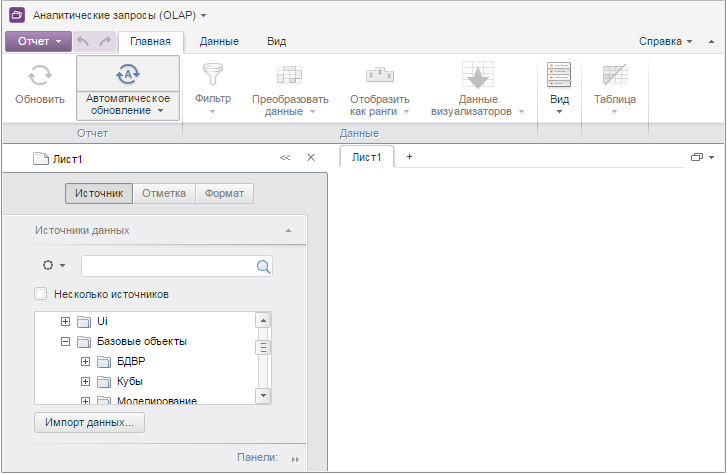

# PP.App.getQueryParam

PP.App.getQueryParam
-

# PP.App.getQueryParam

## Синтаксис

getQueryParam(key: String, queryString: String);

## Параметры

key. Ключ параметра;

queryString. Адрес html-страницы.
 Необязательный параметр, по умолчанию его значение равно адресу текущей
 html-страницы.

## Описание

Метод getQueryParam возвращает
 значение параметра у адреса html-страницы.

## Пример

Для выполнения примера необходимо, чтобы был открыт на редактирование
 любой экспресс-отчёт. Указанный ниже сценарий нужно запустить в консоли
 браузера.

Уберём в адресе текущей html-страницы параметры «mode» и «key»:

// Определим, открыт ли текущий экспресс-отчёт на редактирование
var openMode = PP.App.getQueryParam(PP.App.QueryParamEnum.Mode);
// Если включен режим редактирования, то уберём параметр «mode»
if (openMode == PP.App.OpenMode.Edit) {
    window.location.href = PP.App.joinQueryParam(PP.App.QueryParamEnum.Mode, null, window.location.href, '&');
};
// Удалим параметр «key»
if (PP.App.getQueryParam(PP.App.QueryParamEnum.Key)) {
    window.location.href = PP.App.joinQueryParam(PP.App.QueryParamEnum.Key, null, window.location.href, '#');
};
В результате выполнения примера в адресе текущей html-страницы были
 удалены параметры «mode» и «key», вследствие чего был загружен новый
 экспресс-отчёт:

См. также:

[PP.App](../PP.App.htm)

		Справочная
		 система на версию 10.9
		 от 18/08/2025,
		 © ООО «ФОРСАЙТ»,
