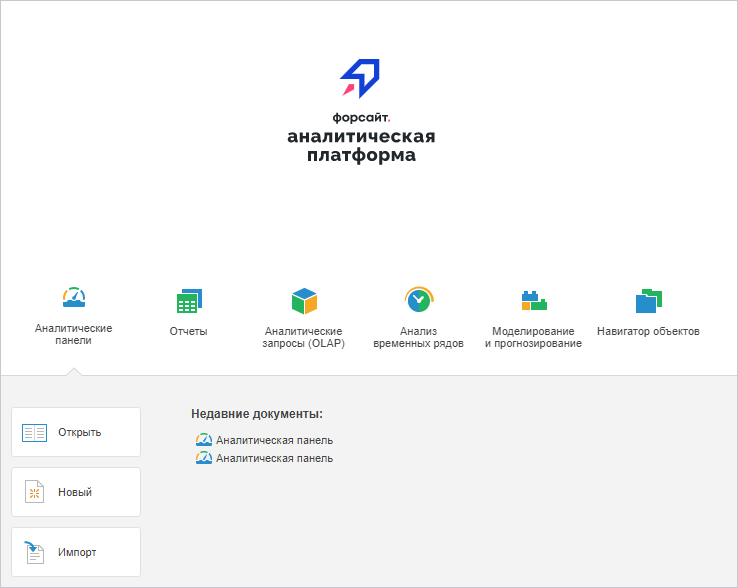

# PP.App.initWelcomeScreen

PP.App.initWelcomeScreen
-

# PP.App.initWelcomeScreen

## Синтаксис

initWelcomeScreen(settings: Object);

## Параметры

settings. Настройки приложения.
 В качестве значения параметра устанавливается JSON-объект со свойствами,
 приведёнными на странице описания метода [PP.App.init](PP.App.init.htm).

## Описание

Метод initWelcomeScreen инициализирует
 окно приветствия.

## Пример

Для выполнения примера необходимо, чтобы был открыт навигатор объектов
 приложения. Указанные ниже сценарии нужно запустить в консоли браузера.

Откроем окно приветствия приложения:

PP.App.initWelcomeScreen();
После выполнения данной строки сценария будет загружена страница с окном
 приветствия:

Откроем страницу для входа в систему:

PP.App.initLoginForm();
В результате выполнения примера будет загружена страница для входа в
 систему:

См. также:

[PP.App](../PP.App.htm)

		Справочная
		 система на версию 10.9
		 от 18/08/2025,
		 © ООО «ФОРСАЙТ»,
