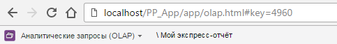

# PP.App.setMbObject

PP.App.setMbObject
-

# PP.App.setMbObject

## Синтаксис

setMbObject(mbObject: [PP.Mb.Object](dhtmlMetabase.chm::/Classes/Metabase/Object/Object.htm),
 settings: Object);

## Параметры

mbObject. Объект репозитория;

settings. Дополнительные настройки
 в виде JSON-объекта. Данный объект может содержать поле SkipStorage -
 признак игнорирования хранилища браузера.

## Описание

Метод setMbObject устанавливает
 новые настройки для текущего объекта репозитория.

## Пример

Для выполнения примера необходимо, чтобы был открыт любой экспресс-отчёт.
 Указанный ниже сценарий нужно запустить в консоли браузера.

Установим для текущего экспресс-отчёта новый ключ и наименование:

var mbObject = new PP.Mb.Object({
    Key: 4960, // Ключ открываемого экспресс-отчёта
    Name: "Мой экспресс-отчёт"
});
// Установим новый объект репозитория
PP.App.setMbObject(mbObject);
В результате выполнения примера для текущего экспресс-отчёта был установлен
 новый ключ и наименование:

См. также:

[PP.App](../PP.App.htm)

		Справочная
		 система на версию 10.9
		 от 18/08/2025,
		 © ООО «ФОРСАЙТ»,
