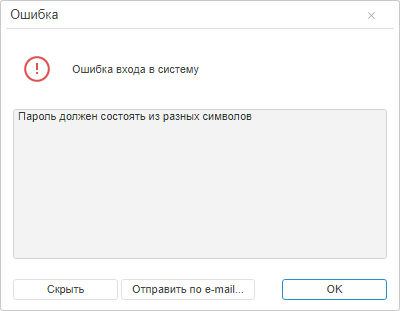

# LoginForm.checkPwdPolicy

LoginForm.checkPwdPolicy
-

# LoginForm.checkPwdPolicy

## Синтаксис

checkPwdPolicy(code: [PP.Mb.FaultCodes](dhtmlMetabase.chm::/Enums/FaultCodes.htm));

## Параметры

code. Код ошибки сервера SoapFault.

## Описание

Метод checkPwdPolicy проверяет,
 удовлетворяет ли пароль требованиям политики безопасности.

## Комментарии

Метод возвращает значение true,
 если пароль удовлетворяет требованиями политики безопасности, и значение
 false - в противном случае.

## Пример

Для выполнения примера необходимо, чтобы была открыта страница входа
 в веб-приложение «Форсайт. Аналитическая платформа».
 Указанный ниже сценарий должен быть выполнен в консоли браузера.

Вызовем ошибку входа в систему и обработаем её, отобразив на странице
 окно с сообщением о данной ошибке, а также соответствующее уведомление
 в окне входа:

// Получим окно для входа в систему
var loginForm = PP.App.getModuleObject();
// Определим обработчик ошибки
var onMetabaseError = function (sender, args) {
    var fault = {
        Code: PP.Mb.FaultCodes.None,
        Message: "Ошибка входа в систему",
        Detail: "Проверьте имя пользователя и его пароль"
    };
if (args.ResponseText != undefined) {
        fault = PP.Mb.FaultParser.parse (args.ResponseText);
    };
    if (!loginForm.checkPwdPolicy(fault.Code)) {
        PP.App.MessageInfo.showFault(fault);
    };
    console.log("test");
    // Укажем общую ошибку
PP.App.getModuleObject().getReportBox().getLoginForm().setError("Ошибка входа в систему");
};
// Получим конфигурацию метабазы
var metabaseConfig = loginForm.getMetabaseConfig(loginForm);
// Обработаем ошибку
metabaseConfig.Error = new PP.Delegate(onMetabaseError);
var responseText = "{ \"Fault\": { " +
    "\"faultcode\": \"soapenv:Sender\", " +
    "\"faultstring\": \"Ошибка входа в систему\", " +
    "\"detail\": { \"Error\": { \"Message\": \"Пароль должен состоять из разных символов\", " +
    "\"Code\": " + PP.Mb.FaultCodes.KE_SOM_PWD_CHARSDIF + ", \"StackTrace\": \"\" } } } }";
// Вызовем событие Error
metabaseConfig.Error.fire(this, {
    ResponseText: responseText
});
В результате выполнения примера было отображено окно с описанием ошибки
 входа в систему. После нажатия на кнопку «Подробнее»
 данное окно выглядит следующим образом:

Уведомление «Ошибка входа в систему» было также выведено в окне входа
 в веб-приложение «Форсайт. Аналитическая платформа».

См. также:

[LoginForm](LoginForm.htm)

		Справочная
		 система на версию 10.9
		 от 18/08/2025,
		 © ООО «ФОРСАЙТ»,
