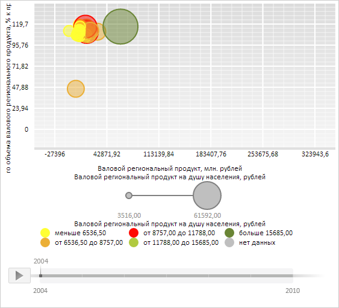

# BubbleChart.BubbleStyle

BubbleChart.BubbleStyle
-

**

# BubbleChart.BubbleStyle

## Синтаксис

BubbleStyle: [PP.Ui.VisualizerItemStyle](../../../Enums/VisualizerItemStyle.htm);

## Описание

Свойство BubbleStyle**
 определяет стиль пузырьков пузырьковой диаграммы.

## Комментарии

Значение свойства устанавливается из JSON и с помощью метода setBubbleStyle,
 а возвращается с помощью метода getBubbleStyle.

## Пример

Для выполнения примера необходимо наличие на html-странице компонента
 [BubbleChart](../../../Components/BubbleChart/BubbleChart.htm)
 с наименованием «bubbleChart» (см. «[Пример
 создания компонента BubbleChart](../../../Components/BubbleChart/BubbleChart_Example.htm)»). Сделаем пузырьки пузырьковой диаграммы прозрачными,
 а для пузырьков, соответствующих значениям, меньшим первому элементу шкалы,
 установим заливку жёлтого цвета:

// Сделаем пузырьки пузырьковой диаграммы прозрачными
bubbleChart.setBubbleStyle(PP.Ui.VisualizerItemStyle.Transparent);
// Изменим цвет пузырьков для значений, меньших первому элементу шкалы
var colorVisual = bubbleChart.getColorVisual();
colorVisual.getColorMapping().getScale().getItems()[0].setColor("#FFFF33")
bubbleChart.setColorVisual(colorVisual);
// Обновим пузырьковую диаграмму
bubbleChart.refresh();

В результате выполнения примера пузырьки пузырьковой диаграммы стали прозрачными,
 а цвет заливки для пузырьков, соответствующих значениям, меньшим первому
 элементу шкалы, изменился на жёлтый:

См. также:

[BubbleChart](BubbleChart.htm)

		Справочная
		 система на версию 10.9
		 от 18/08/2025,
		 © ООО «ФОРСАЙТ»,
