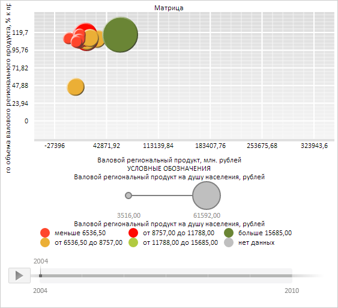

# BubbleChart.ChartArea

BubbleChart.ChartArea
-

**

# BubbleChart.ChartArea

## Синтаксис

ChartArea: [PP.Ui.ChartArea](../ChartArea/ChartArea.htm);

## Описание

Свойство ChartArea** определяет
 область построения пузырьковой диаграммы.

## Комментарии

Значение свойства устанавливается из JSON и с помощью метода setChartArea,
 а возвращается с помощью метода getChartArea.

## Пример

Для выполнения примера необходимо наличие на html-странице компонента
 [BubbleChart](../../../Components/BubbleChart/BubbleChart.htm)
 с наименованием «bubbleChart» (см. «[Пример
 создания компонента BubbleChart](../../../Components/BubbleChart/BubbleChart_Example.htm)»). Укажем для области пузырьковой
 диаграммы заголовок и нижний колонтитул:

// Получим область графика
var chartArea = bubbleChart.getChartArea();
// Зададим нижний колонтитул для области графика
var text = "Условные обозначения";
chartArea.setFooter(new PP.Ui.ChartLabel({
    Text: text.toUpperCase()
}));
// Зададим заголовок для области графика
chartArea.setHeader(new PP.Ui.ChartLabel({
    Text: "пузырьковая диаграмма",
    VerticalAlignment: PP.VerticalAlignment.Top
}));
// Установим для пузырьковой диаграммы обновлённую область графика
bubbleChart.setChartArea(chartArea);
// Обновим пузырьковую диаграмму
bubbleChart.refresh();

В результате выполнения примера для области пузырьковой диаграммы был
 указан заголовок «пузырьковая диаграмма» и нижний колонтитул с текстом
 «Условные обозначения»:

См. также:

[BubbleChart](BubbleChart.htm)

		Справочная
		 система на версию 10.9
		 от 18/08/2025,
		 © ООО «ФОРСАЙТ»,
