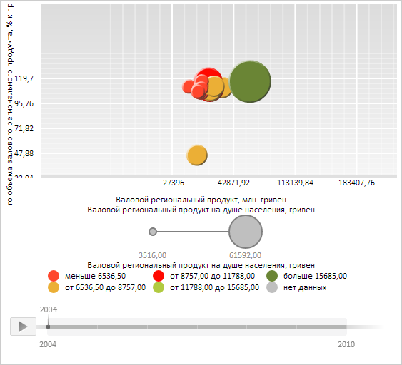

# BubbleChart.OffsetX

BubbleChart.OffsetX
-

**

# BubbleChart.OffsetX

## Синтаксис

OffsetX: Number;

## Описание

Свойство OffsetX** определяет
 отступ пузырьков от левой границы области построения пузырьковой диаграммы.

## Комментарии

Значение свойства устанавливается из JSON и с помощью метода **setOffsetX**,
 а возвращается с помощью метода getOffsetX.

## Пример

Для выполнения примера необходимо наличие на html-странице компонента
 [BubbleChart](../../../Components/BubbleChart/BubbleChart.htm)
 с наименованием «bubbleChart» (см. «[Пример
 создания компонента BubbleChart](../../../Components/BubbleChart/BubbleChart_Example.htm)»). Установим отступы пузырьков пузырьковой диаграммы
 относительно левой и верхней границы области её построения:

// Установим отступ по горизонтали
bubbleChart.setOffsetX(150);
// Установим отступ по вертикали
bubbleChart.setOffsetY(70);
// Перестроим все элементы пузырьковой диаграммы
bubbleChart.rebuildAll();

В результате выполнения примера для пузырьков пузырьковой диаграммы относительно её
 левой границы был установлен отступ, равный 150 пикселям, а относительно
 верхней границы - отступ, равный 70 пикселям:

См. также:

[BubbleChart](BubbleChart.htm)

		Справочная
		 система на версию 10.9
		 от 18/08/2025,
		 © ООО «ФОРСАЙТ»,
