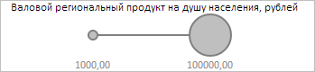

# BubbleChart.RVisual

BubbleChart.RVisual
-

**

# BubbleChart.RVisual

## Синтаксис

RVisual: PP.SizeVisual;

## Описание

Свойство RVisual** содержит
 настройки сопоставления значений рядов размерам пузырьков пузырьковой диаграммы, соответствующих
 этим данным.

## Комментарии

Значение свойства устанавливается с помощью метода setRVisual,
 а возвращается с помощью метода getRVisual.
 Из JSON значение свойства задать нельзя.

## Пример

Для выполнения примера необходимо наличие на html-странице компонента
 [BubbleChart](../../../Components/BubbleChart/BubbleChart.htm)
 с наименованием «bubbleChart» (см. «[Пример
 создания компонента BubbleChart](../../../Components/BubbleChart/BubbleChart_Example.htm)»). Изменим минимальное и максимальное
 значения данных в легенде, описывающей размеры пузырьков пузырьковой диаграммы:

// Задаём область пузырьковой диаграммы с целью корректного её обновления
bubbleChart.setChartArea({
    Axes: bubbleChart.getChartArea().getAxes()
});
/* Получим настройки сопоставления значений рядов
размерам пузырьков пузырьковой диаграммы, соответствующих этим данным. */
var rVisual = bubbleChart.getRVisual();
// Установим минимальный и максимальный размер пузырьков пузырьковой диаграммы
var scale = rVisual.getNumericMapping().getScale();
scale._MinValue = 1000;
scale._MaxValue = 100000;
// Применим новые настройки
bubbleChart.setRVisual(rVisual);
// Обновим пузырьковую диаграмму
bubbleChart.refresh();

В результате выполнения примера в легенде, описывающей размеры
 пузырьков пузырьковой диаграммы, было установлено минимальное и максимальное значения,
 равные 1000 и 100000 соответственно:

См. также:

[BubbleChart](BubbleChart.htm)

		Справочная
		 система на версию 10.9
		 от 18/08/2025,
		 © ООО «ФОРСАЙТ»,
