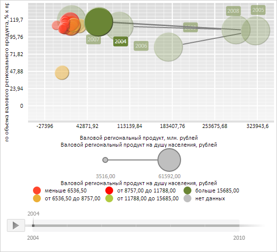

# BubbleChart.ShowBubbleHistoryLabels

BubbleChart.ShowBubbleHistoryLabels
-

**

# BubbleChart.ShowBubbleHistoryLabels

## Синтаксис

ShowBubbleHistoryLabels: Boolean;

## Описание

Свойство ShowBubbleHistoryLabels**
 содержит признак отображения подписей в истории значений для пузырьков
 пузырьковой диаграммы.

## Комментарии

Значение свойства устанавливается из JSON и с помощью метода set**ShowBubbleHistoryLabels**,
 а возвращается с помощью метода get**ShowBubbleHistoryLabels**.

Свойство содержит значение true,
 если отображение подписей в истории значений для пузырьков пузырьковой диаграммы разрешено,
 и значение false, если запрещено.

## Пример

Для выполнения примера необходимо наличие на html-странице компонента
 [BubbleChart](../../../Components/BubbleChart/BubbleChart.htm)
 с наименованием «bubbleChart» (см. «[Пример
 создания компонента BubbleChart](../../../Components/BubbleChart/BubbleChart_Example.htm)»). До выполнения примера в истории
 значений для пузырьков пузырьковой диаграммы отображаются подписи с указанием года:

Запретим отображение данных меток:

// Запретим отображение подписей в истории всех рядов пузырьковой диаграммы
bubbleChart.setShowBubbleHistoryLabels(false);
// Получим пузырёк пузырьковой диаграммы из 27-го ряда данных
var point = bubbleChart.getSeries()[26].getPoints()[0];
// Сгенерируем и отобразим историю значений для данного ряда
point.setHistory(new PP.Ui.ChartHistory({
    Chart: bubbleChart
}));
point.setIsHistoryOn(true);

В результате выполнения примера в истории значений для пузырьков пузырьковой диаграммы
 перестали отображаться подписи:

См. также:

[BubbleChart](BubbleChart.htm)

		Справочная
		 система на версию 10.9
		 от 18/08/2025,
		 © ООО «ФОРСАЙТ»,
