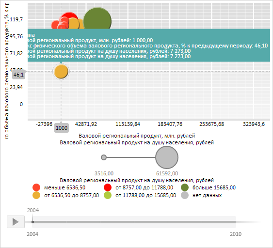

# BubbleChart.UseBubbleFillForTooltip

BubbleChart.UseBubbleFillForTooltip
-

**

# BubbleChart.UseBubbleFillForTooltip

## Синтаксис

UseBubbleFillForTooltip: Boolean;

## Описание

Свойство UseBubbleFillForTooltip**
 содержит признак использования цвета пузырьков пузырьковой диаграммы для заливки всплывающих
 подсказок.

## Комментарии

Значение свойства устанавливается из JSON и с помощью метода set**UseBubbleFillForTooltip**,
 а возвращается с помощью метода get**UseBubbleFillForTooltip**.

Свойство содержит значение true,
 если для заливки всплывающих подсказок используется цвет пузырьков пузырьковой диаграммы,
 и значение false, если не используется.

## Пример

Для выполнения примера необходимо наличие на html-странице компонента
 [BubbleChart](../../../Components/BubbleChart/BubbleChart.htm)
 с наименованием «bubbleChart» (см. «[Пример
 создания компонента BubbleChart](../../../Components/BubbleChart/BubbleChart_Example.htm)»). Запретим использование цвета пузырьков
 пузырьковой диаграммы для заливки всплывающих подсказок:

// Запретим использовать цвет пузырьков для заливки всплывающих подсказок
bubbleChart.setUseBubbleFillForTooltip(false);
// Получим пузырёк пузырьковой диаграммы из первого ряда данных
var point = bubbleChart.getSeries()[0].getPoints()[0];
// Сгенерируем и отобразим всплывающую подсказку для данной точки
point.setTooltip(new PP.Ui.ChartTooltip());
point.setIsTooltipOn(true);
// Выделим данную точку
point.setSelection(new PP.Ui.ChartSelection({
    Chart: bubbleChart
}));
point.setIsCrosshairOn(true);

В результате выполнения примера для выбранной точки ряда была
 отображена всплывающая подсказка. При этом для заливки данной подсказки
 цвет пузырьков пузырьковой диаграммы теперь не используется:

См. также:

[BubbleChart](BubbleChart.htm)

		Справочная
		 система на версию 10.9
		 от 18/08/2025,
		 © ООО «ФОРСАЙТ»,
