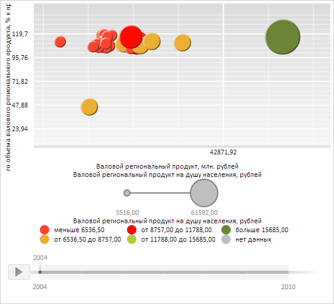

# BubbleChart.XVisual

BubbleChart.XVisual
-

**

# BubbleChart.XVisual

## Синтаксис

XVisual: PP.CoordinateVisual;

## Описание

Свойство XVisual** содержит
 настройки сопоставления значений рядов оси X пузырьковой диаграммы.

## Комментарии

Значение свойства устанавливается с помощью метода setXVisual,
 а возвращается с помощью метода getXVisual.
 Из JSON значение свойства задать нельзя.

## Пример

Для выполнения примера необходимо наличие на html-странице компонента
 [BubbleChart](../../../Components/BubbleChart/BubbleChart.htm)
 с наименованием «bubbleChart» (см. «[Пример
 создания компонента BubbleChart](../../../Components/BubbleChart/BubbleChart_Example.htm)»). Изменим минимальные и максимальные
 значения для осей X и Y пузырьковой диаграммы:

// Получим настройки сопоставления данных рядов осям X и Y пузырьковой диаграммы
var xVisual = bubbleChart.getXVisual();
var yVisual = bubbleChart.getYVisual();
// Установим минимальное и максимальное значение для оси X пузырьковой диаграммы
var xDataTransformer = xVisual.getCoordinateMapping().getDataTransformer();
xDataTransformer.setMinValue(-10000);
xDataTransformer.setMaxValue(70000);
// Установим минимальное и максимальное значение для оси Y пузырьковой диаграммы
var yDataTransformer = yVisual.getCoordinateMapping().getDataTransformer();
yDataTransformer.setMinValue(25);
yDataTransformer.setMaxValue(130);
// Применим новые настройки данных рядов осям X и Y пузырьковой диаграммы
bubbleChart.setXVisual(xVisual);
bubbleChart.setYVisual(yVisual);
// Обновим пузырьковую диаграмму
bubbleChart.refresh();

В результате выполнения примера для оси X было установлено минимальное
 значение -10000 и максимальное значение, равное 70000. Соответствующим
 образом для оси Y были заданы значения 25 и 130:

См. также:

[BubbleChart](BubbleChart.htm)

		Справочная
		 система на версию 10.9
		 от 18/08/2025,
		 © ООО «ФОРСАЙТ»,
