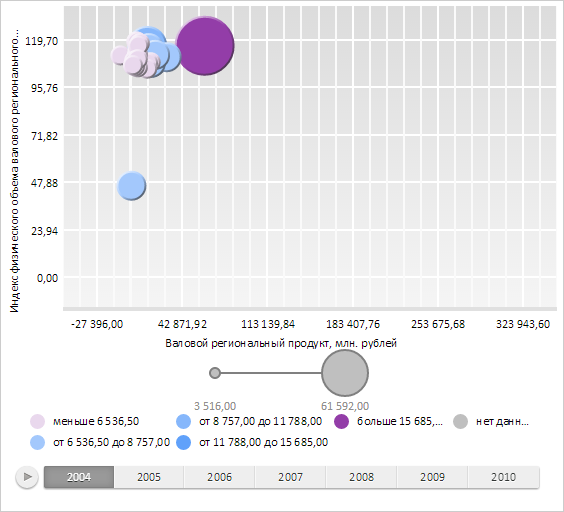
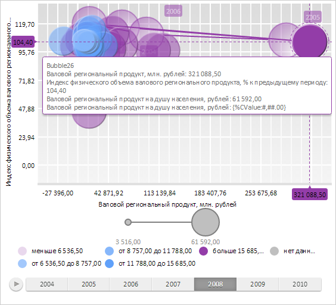

# BubbleChart.applyColorScheme

BubbleChart.applyColorScheme
-

# BubbleChart.applyColorScheme

## Синтаксис

applyColorScheme(palette: Array);

## Параметры

palette. Массив значений цветовой
 шкалы.

## Описание

Метод applyColorScheme применяет цветовую шкалу пузырьковой диаграммы.

Элементы массива - экземпляры класса [PP.Color](dhtmlCommon.chm::/Classes/PP/color/color.htm)
 или строки со значением цвета в одном из следующих форматов:

	- "red";

	- "#000";

	- "RGB(123, 12, 1)".

## Пример

Для выполнения примера необходимо наличие на html-странице компонента
 [BubbleChart](../../../Components/BubbleChart/BubbleChart.htm)
 с наименованием «bubbleChart» (см. «[Пример
 создания компонента BubbleChart](../../../Components/BubbleChart/BubbleChart_Example.htm)»).

Создадим и установим цветовую шкалу пузырьковой диаграммы, установим стиль пузырьков
 истории значений и соединяющих линий, а также установим обработчик [события наведения указателя на
 пузырек](BubbleChart.ItemHovered.htm):

// Создаем массив со значениями цветовой шкалы пузырьковой диаграммы
var palette = ["#E9D8ED", "#A3C8FC", "#86B7FB", "#60A1FA", "#933DA8"];
// Устанавливаем цветовую шкалу пузырьковой диаграммы
bubbleChart.setPalette(palette);
// Применяем цветовую шкалу пузырьковой диаграммы
bubbleChart.applyColorScheme(bubbleChart.getPalette());
// Устанавливаем стиль пузырьков истории значений
bubbleChart.setHistoryBubbleStyle(PP.Ui.VisualizerItemStyle.RadialGradient);
// Определяем, будет ли для соединительных линий применяться тот же цвет, что и для пузырьков
bubbleChart.setUseBubbleColorForHistoryLines(true);
// Добавляем обработчик события ItemHovered
bubbleChart.ItemHovered.add(
    function() {
        console.log("Событие ItemHovered");
        // Перерисовываем пузырьки пузырьковой диаграммы
        bubbleChart.requestRenderFrame(true, false);
    }
);
// Обновляем пузырьковую диаграмму
bubbleChart.refresh();
В результате для пузырьковой диаграммы будет установлена новая цветовая шкала:

Далее выберем на шкале времени значение «2008» и наведем указатель на
 один из пузырьков. В результате для выбранного пузырька будут отображены
 пузырьки истории значений, соединенные с помощью линий, для которых были
 применены цвета этих пузырьков. Для пузырьков истории значений был установлен
 объемный стиль отображения с радиальным градиентом:

Также в консоли браузера будет выведено сообщение о наступлении события
 наведения указателя на один из пузырьков пузырьковой диаграммы:

Событие ItemHovered

См. также:

[BubbleChart](BubbleChart.htm)

		Справочная
		 система на версию 10.9
		 от 18/08/2025,
		 © ООО «ФОРСАЙТ»,
