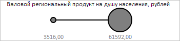

# BubbleChart.getSizeLegend

BubbleChart.getSizeLegend
-

**

# BubbleChart.getSizeLegend

## Синтаксис

getSizeLegend();

## Описание

Метод getSizeLegend** возвращает легенду, описывающую размеры пузырьков пузырьковой диаграммы.

## Комментарии

Метод возвращает значение типа PP.Ui.SizeLegend.

## Пример

Для выполнения примера необходимо наличие на html-странице компонента [BubbleChart](../../../Components/BubbleChart/BubbleChart.htm) с наименованием «bubbleChart» (см. «[Пример создания компонента BubbleChart](../../../Components/BubbleChart/BubbleChart_Example.htm)»). Установим для пузырьков легенды, описывающей их размеры в пузырьковой диаграмме, чёрный цвет заливки:

// Получим легенду, описывающую размеры пузырьков пузырьковой диаграммы
var sizeLegend = bubbleChart.getSizeLegend();
// Установим чёрный цвет заливки для пузырьков пузырьковой диаграммы
sizeLegend.setMarkerColor("#000000");
// Обновим легенду
bubbleChart.refresh();

В результате выполнения примера для пузырьков легенды, описывающей их размеры в пузырьковой диаграмме, чёрный цвет заливки:

См. также:

[BubbleChart](BubbleChart.htm)

		Справочная
		 система на версию 10.9
		 от 18/08/2025,
		 © ООО «ФОРСАЙТ»,
