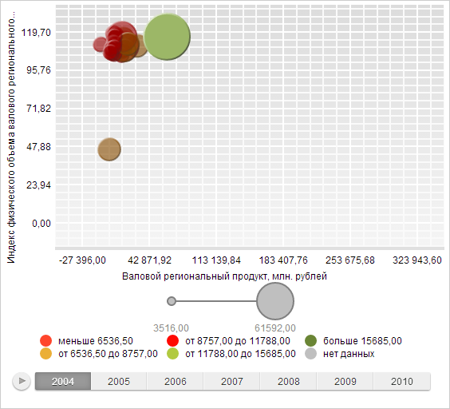

# BubbleChart.hoverItems

BubbleChart.hoverItems
-

# BubbleChart.hoverItems

## Синтаксис

hoverItems(items: Object, timelineStep: Number);

## Параметры

items. Элементы, которые необходимо
 подсветить;

timelineStep. Шаг временной
 шкалы.

## Описание

Метод hoverItems устанавливает
 подсветку указанных пузырьков пузырьковой диаграммы.

## Пример

Для выполнения примера необходимо наличие на html-странице компонента
 [BubbleChart](../../../Components/BubbleChart/BubbleChart.htm)
 с наименованием «bubbleChart» (см. «[Пример
 создания компонента BubbleChart](../../../Components/BubbleChart/BubbleChart_Example.htm)»).

Создадим эффекты подсветки и установим их для пузырьковой диаграммы, установим подсветку
 для указанных элементов, преобразуем цвет на основе эффекта подсветки:

// Создаем эффект подсветки
var highlightActiveEffect = new PP.Ui.HighlightEffect();
// Устанавливаем смещение красного компонента
highlightActiveEffect.setROffset(50);
// Устанавливаем смещение зеленого компонента
highlightActiveEffect.setGOffset(50);
// Устанавливаем смещение синего компонента
highlightActiveEffect.setBOffset(50);
// Устанавливаем смещение компонента прозрачности
highlightActiveEffect.setAOffset(50);
// Создаем эффект подсветки
var highlightInactiveEffect = new PP.Ui.HighlightEffect();
// Устанавливаем смещение красного компонента
highlightInactiveEffect.setROffset(-100);
// Устанавливаем смещение зеленого компонента
highlightInactiveEffect.setGOffset(-100);
// Устанавливаем смещение синего компонента
highlightInactiveEffect.setBOffset(-100);
// Устанавливаем смещение компонента прозрачности
highlightInactiveEffect.setAOffset(-100);
// Устанавливаем эффекты подсветки
if (bubbleChart.getEnableHover()) {
    bubbleChart.setHoverActiveEffects([highlightActiveEffect]);
    bubbleChart.setHoverInactiveEffects([highlightInactiveEffect]);
}
// Определим цвет и преобразуем его на основе эффекта подсветки
var color = new PP.Color(255, 0, 0);
console.log("Компоненты цвета до преобразования: " + color.getR() + " " + color.getG() + " " + color.getB());
highlightActiveEffect.apply(color);
console.log("Компоненты цвета после преобразования: " + color.getR() + " " + color.getG() + " " + color.getB());
// Определяем пузырьки пузырьковой диаграммы, которые необходимо подсветить
var hoveredItems = {
    Serie0_Point0: true
}
// Устанавливаем подсветку объектов
bubbleChart.hoverItems(hoveredItems, 0);
В результате выполнения будет установлена подсветка указанного пузырька
 пузырьковой диаграммы. При этом изменится внешний вид остальных пузырьков:

Также в консоли браузера будут выведены значения компонентов цвета до
 и после преобразования:

Компоненты цвета до преобразования: 255 0 0

Компоненты цвета после преобразования: 255 50 50

Уберем подсветку элементов:

// Устанавливаем пустой массив объектов, которые необходимо подсветить
bubbleChart.setHoveredItems();
// Обновляем пузырьковую диаграмму
bubbleChart.refresh();
В результате пузырьковая диаграмма вернется в начальное состояние.

Установим подсветку другого элемента:

// Получаем точку ряда пузырьковой диаграммы
var point = bubbleChart.getSeries()[26].getPoints()[0];
// Подсвечиваем точку ряда
bubbleChart.setItemHoverness(point, true);
// Обновляем пузырьковую диаграмму
bubbleChart.refresh();
В результате была установлена подсветка элемента пузырьковой диаграммы:

[BubbleChart](BubbleChart.htm)

		Справочная
		 система на версию 10.9
		 от 18/08/2025,
		 © ООО «ФОРСАЙТ»,
