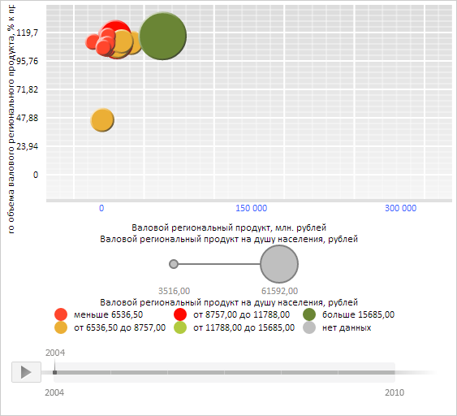

# BubbleChartObjectCollection.rebuild

BubbleChartObjectCollection.rebuild
-

**

# BubbleChartObjectCollection.rebuild

## Синтаксис

rebuild();

## Описание

Метод rebuild** очищает пузырьковую диаграмму от коллекции объектов.

## Пример

Для выполнения примера необходимо наличие на html-странице компонента [BubbleChart](../../../Components/BubbleChart/BubbleChart.htm) с наименованием «bubbleChart» (см. «[Пример создания компонента BubbleChart](../../../Components/BubbleChart/BubbleChart_Example.htm)»). Создадим и установим коллекцию из трёх меток для оси X пузырьковой диаграммы:

// Получим ось X пузырьковой диаграммы
var axisX = bubbleChart.getChartArea().getAxisX();
// Очистим коллекцию старых меток для оси X
var labelsCollection = axisX.getLabels();
labelsCollection.rebuild();
// Определим три метки для оси X
var labelsSettings = {
    IntervalsCount: '2', // Общее количество интервалов между метками
    Margin: '5 5 5 5', // Внешние отступы меток
    Chart: bubbleChart, // пузырьковая диаграмма
    VisualType: axisX.getType(), // Тип элемента пузырьковой диаграммы
    MaskText: "{%Value:#,##.}", // Маска текста для меток
    Style: { // Окрасим метки в синий цвет
        Release: new PP.Style({
            Font: {
                Color: "#3366FF"
            }
        })
    },
    IsVisible: true,
    Min: 0, // Минимальное значение
    Max: 300000 // Максимальное значение
};
// Создадим коллекцию меток
var labels = new PP.Ui.ChartLabelCollection(labelsSettings);
// Создадим и установим коллекцию меток
axisX.setLabels(labels);
// Обновим пузырьковую диаграмму
bubbleChart.refresh();

В результате выполнения примера для оси X пузырьковой диаграммы была создана и установлена коллекция из трёх меток синего цвета со целыми значениями от 0 до 300000:

См. также:

[BubbleChartObjectCollection](BubbleChartObjectCollection.htm)

		Справочная
		 система на версию 10.9
		 от 18/08/2025,
		 © ООО «ФОРСАЙТ»,
