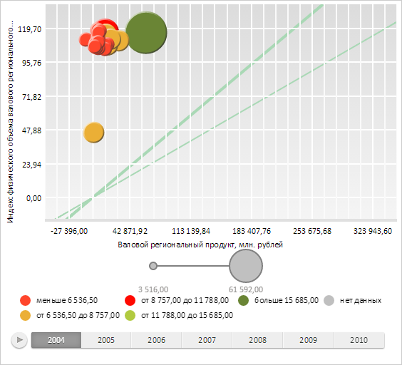

# Конструктор ChartAngleLineCollection

Конструктор ChartAngleLineCollection
-

# Конструктор ChartAngleLineCollection

## Синтаксис

PP.Ui.ChartAngleLineCollection(settings);

## Параметры

settings. JSON-объект
 со значениями свойств компонента.

## Описание

Конструктор ChartAngleLineCollection
 создает экземпляр класса [ChartAngleLineCollection](ChartAngleLineCollection.htm).

## Пример

Для выполнения примера необходимо наличие на html-странице компонента
 [BubbleChart](../../../Components/BubbleChart/BubbleChart.htm)
 с наименованием «bubbleChart» (см. «[Пример
 создания компонента BubbleChart](../../../Components/BubbleChart/BubbleChart_Example.htm)»). Создадим две наклонные линии и
 отрисуем их на пузырьковой диаграмме:

// Получаем область построения пузырьковой диаграммы
var chartArea = bubbleChart.getChartArea();
// Создаем первую линию
var angleLine1 = new PP.Ui.ChartAngleLine({
    Chart: bubbleChart,
    Value: 30,
});
// Создаем вторую линию
var angleLine2 = new PP.Ui.ChartAngleLine({
    Chart: bubbleChart,
    Value: 40,
    Thickness: 4
});
// Создаем коллекцию наклонных линий
var angleLineCol = new PP.Ui.ChartAngleLineCollection({
    Chart: bubbleChart,
    Thickness: 2,
    Stroke: "#A9D8B5",
    Items: [ angleLine1, angleLine2 ]
});
// Устанавливаем коллекцию наклонных линий области пузырьковой диаграммы
chartArea.setAngleLines(angleLineCol);
// Обновляем данные у коллекции для перерисовки
angleLineCol.draw();
// Обновляем область построения пузырьковой диаграммы
chartArea.renderFrame();
В результате на пузырьковой диаграмме были отрисованы две наклонные линии с разным
 углом наклона:

См. также:

[ChartAngleLineCollection](ChartAngleLineCollection.htm)

		Справочная
		 система на версию 10.9
		 от 18/08/2025,
		 © ООО «ФОРСАЙТ»,
