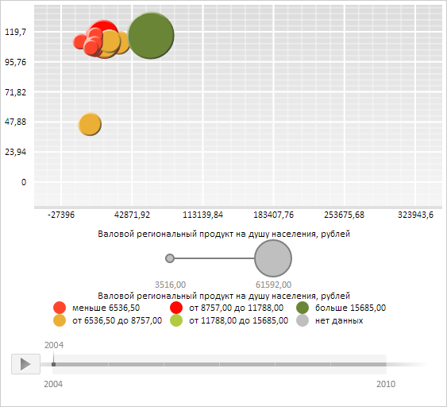

# ChartArea.Axes

ChartArea.Axes
-

**

# ChartArea.Axes

## Синтаксис

Axes: Object

## Описание

Свойство Axes** определяет
 оси X и Y области построения пузырьковой диаграммы.

## Комментарии

Значение свойства устанавливается из JSON и с помощью метода setAxes,
 а возвращается с помощью метода getAxes.
 Свойство содержит следующие поля: X - определяет ось X области пузырьковой диаграммы,
 Y - определяет ось Y области пузырьковой диаграммы, эти поля являются объектами типа
 [PP.Ui.ChartAxis](../ChartAxis/ChartAxis.htm).

## Пример

Для выполнения примера необходимо наличие на html-странице компонента
 [BubbleChart](../../../Components/BubbleChart/BubbleChart.htm)
 с наименованием «bubbleChart» (см. «[Пример
 создания компонента BubbleChart](../../../Components/BubbleChart/BubbleChart_Example.htm)»). Скроем текст надписей осей X и
 Y области построения пузырьковой диаграммы, обновим ось X:

// Получим область построения пузырьковой диаграммы
var chartArea = bubbleChart.getChartArea();
// Получим оси X и Y области построения пузырьковой диаграммы
var axes = chartArea.getAxes();
var xAxis = axes.X;
var yAxis = axes.Y;
// Скроем текст надписи оси X
xAxis.getCaption().setIsVisible(false);
// Скроем текст надписи оси Y
yAxis.getCaption().setIsVisible(false);
// Присвоим новое значение объекта осей X и Y
axes.X = xAxis;
axes.Y = yAxis;
chartArea.setAxes(axes);
// Обновим пузырьковую диаграмму
bubbleChart.refresh();
// Обновим ось X
chartArea.updateAxis(PP.Ui.VisualType.X);

В результате выполнения примера для области построения пузырьковой диаграммы
 был скрыт текст надписей осей X и Y:

См. также:

[ChartArea](ChartArea.htm)

		Справочная
		 система на версию 10.9
		 от 18/08/2025,
		 © ООО «ФОРСАЙТ»,
