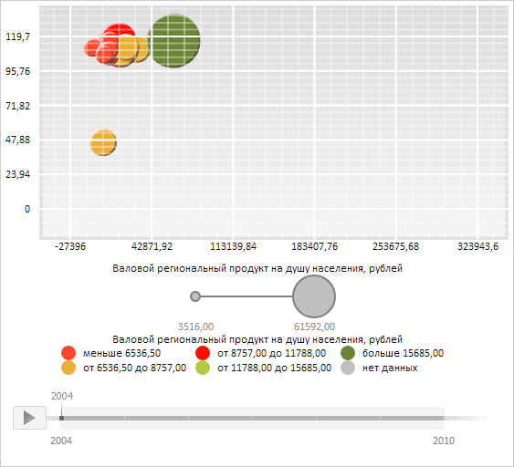

# ChartArea.AxisX

ChartArea.AxisX
-

**

# ChartArea.AxisX

## Синтаксис

AxisX: [PP.Ui.ChartAxis](../ChartAxis/ChartAxis.htm)

## Описание

Свойство AxisX** определяет
 ось X области построения пузырьковой диаграммы.

## Комментарии

Значение свойства устанавливается с помощью метода setAxisX,
 а возвращается с помощью метода getAxisX.
 Из JSON свойство установить нельзя.

## Пример

Для выполнения примера необходимо наличие на html-странице компонента
 [BubbleChart](../../../Components/BubbleChart/BubbleChart.htm)
 с наименованием «bubbleChart» (см. «[Пример
 создания компонента BubbleChart](../../../Components/BubbleChart/BubbleChart_Example.htm)»). Скроем текст надписей осей
 X и Y области пузырьковой диаграммы, отобразим левую и правую границы сетки области
 построения, отобразим сетку области построения поверх пузырьков, перерисуем
 область построения и оси пузырьковой диаграммы:

// Получим область построения пузырьковой диаграммы
var chartArea = bubbleChart.getChartArea();
// Получим оси X и Y области построения пузырьковой диаграммы
var xAxis = chartArea.getAxisX();
var yAxis = chartArea.getAxisY();
// Скроем текст надписей осей X и Y
xAxis.getCaption().setIsVisible(false);
yAxis.getCaption().setIsVisible(false);
// Присвоим новые значения осям X и Y
chartArea.setAxisX(xAxis);
chartArea.setAxisY(yAxis);
// Получим сетку пузырьковой диаграммы
var grid = chartArea.getGrid();
// Отобразим левую и правую границы сетки
grid.setLeft(true);
grid.setRight(true);
// Отобразим сетку области построения поверх пузырьков
chartArea.setIsGridBefore(true);
// Установим новое значение сетки
chartArea.setGrid(grid);
// Обновим пузырьковую диаграмму
bubbleChart.refresh();
// Перерисуем область построения и оси пузырьковой диаграммы
chartArea.drawWithoutResize();

В результате выполнения примера для области пузырьковой диаграммы был скрыт текст
 надписей осей X и Y, были отображены левая и правая границы сетки области
 построения, а также сетка области построения была отображена поверх пузырьков:

См. также:

[ChartArea](ChartArea.htm)

		Справочная
		 система на версию 10.9
		 от 18/08/2025,
		 © ООО «ФОРСАЙТ»,
