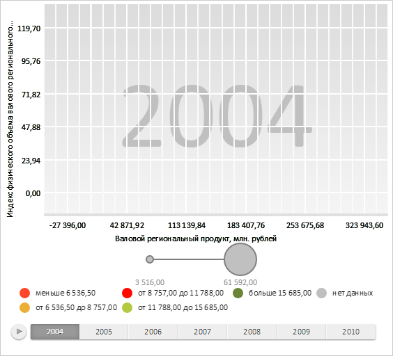

# ChartArea.getBackgroundLabel

ChartArea.getBackgroundLabel
-

**

# ChartArea.getBackgroundLabel

## Синтаксис

getBackgroundLabel();

## Описание

Метод getBackgroundLabel
 возвращает** фоновую метку
 пузырьковой диаграммы, на которой отображается текущий шаг временной шкалы.

## Комментарии

Метод возвращает значение типа PP.Ui.[ChartSVGLabel](../ChartSVGLabel/ChartSVGLabel.htm).

## Пример

Для выполнения примера необходимо наличие на html-странице компонента
 [BubbleChart](../../../Components/BubbleChart/BubbleChart.htm)
 с наименованием «bubbleChart» (см. «[Пример
 создания компонента BubbleChart](../../../Components/BubbleChart/BubbleChart_Example.htm)»). Удалим пузырьки у пузырьковой диаграммы
 и зададим новую область построения:

// Очищаем пузырьковую диаграмму от меток
bubbleChart.getChartArea().getSymbolLayer().clear();
// Задаем новую область построения пузырьковой диаграммы
bubbleChart.setChartArea({
    "Axes": {
        "X": {
            "Type": "X"
        },
        "Y": {
            "Type": "Y"
        }
    },
    "BackgroundLabel": {
        "VerticalAlignment": "Center",
        "HorizontalAlignment": "Center",
        "IsOverlap": true,
        "Style": {
            "Release": {
                "Font": {
                    "Color": "#C0C0C0",
                    "Size": 140
                }
            }
        }
    }
});
// Обновляем пузырьковую диаграмму
bubbleChart.refresh();
В результате с пузырьковой диаграммы были удалены пузырьки, а на фон
 добавлена метка с текущим шагом временной шкалы:

Получим текст фоновой метки:

// Получаем текст фоновой метки
console.log("Текст фоновой метки: " + bubbleChart.getChartArea().getBackgroundLabel().getText());
В результате в консоль был выведен текст фоновой метки:

Текст фоновой метки: 2004

См. также:

[ChartArea](ChartArea.htm)

		Справочная
		 система на версию 10.9
		 от 18/08/2025,
		 © ООО «ФОРСАЙТ»,
