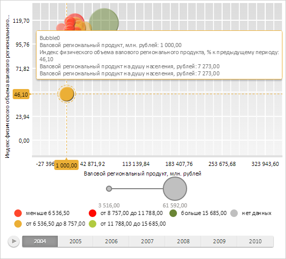
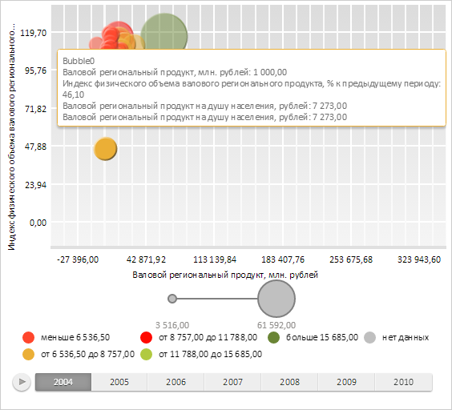

# ChartArea.getCrosshairLayer

ChartArea.getCrosshairLayer
-

# ChartArea.getCrosshairLayer

## Синтаксис

getCrosshairLayer();

## Описание

Метод getCrosshairLayer возвращает
 слой пунктирных линий выделенных элементов области построения пузырьковой диаграммы.

## Комментарии

Возвращаемое значение - экземпляр класса PP.Ui.[Canvas](dhtmlGraphicBase.chm::/Classes/Canvas/Canvas.htm).

## Пример

Для выполнения примера необходимо наличие на html-странице компонента
 [BubbleChart](../../../Components/BubbleChart/BubbleChart.htm)
 с наименованием «bubbleChart» (см. «[Пример
 создания компонента BubbleChart](../../../Components/BubbleChart/BubbleChart_Example.htm)»). Выделим первый элемент пузырьковой диаграммы,
 наведя на него курсор:

Удаляем метки, указывающие на положение пузырька:

// Получаем область построения пузырьковой диаграммы
var chart = bubbleChart.getChartArea();
// Очищаем пунктирные линии выделенного элемента
chart.getCrosshairLayer().clear();
// Очищаем метки показывающие положение пузырька
chart.getCrosshairLabelsLayer().remove();
В результате слой пунктирных линий выделенных элементов и слой меток,
 указывающих на положение выделенных элементов, были удалены:

См. также:

[ChartArea](ChartArea.htm)

		Справочная
		 система на версию 10.9
		 от 18/08/2025,
		 © ООО «ФОРСАЙТ»,
