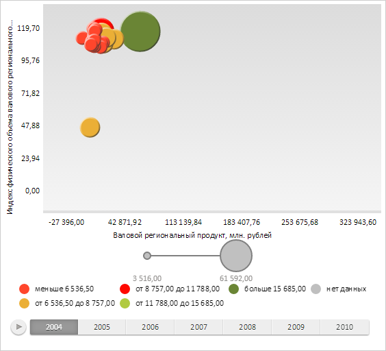

# ChartArea.getGridLayer

ChartArea.getGridLayer
-

# ChartArea.getGridLayer

## Синтаксис

getGridLayer();

## Описание

Метод getGridLayer возвращает
 слой сетки и осей пузырьковой диаграммы.

## Комментарии

Возвращаемое значение - экземпляр класса PP.Ui.[Canvas](dhtmlGraphicBase.chm::/Classes/Canvas/Canvas.htm).

## Пример

Для выполнения примера необходимо наличие на html-странице компонента
 [BubbleChart](../../../Components/BubbleChart/BubbleChart.htm)
 с наименованием «bubbleChart» (см. «[Пример
 создания компонента BubbleChart](../../../Components/BubbleChart/BubbleChart_Example.htm)»). Очистим слой сетки и осей пузырьковой диаграммы:

// Очищаем слой сетки и осей пузырьковой диаграммы
bubbleChart.getChartArea().getGridLayer().clear();
В результате у пузырьковой диаграммы был удален слой сетки и осей:

См. также:

[ChartArea](ChartArea.htm)

		Справочная
		 система на версию 10.9
		 от 18/08/2025,
		 © ООО «ФОРСАЙТ»,
