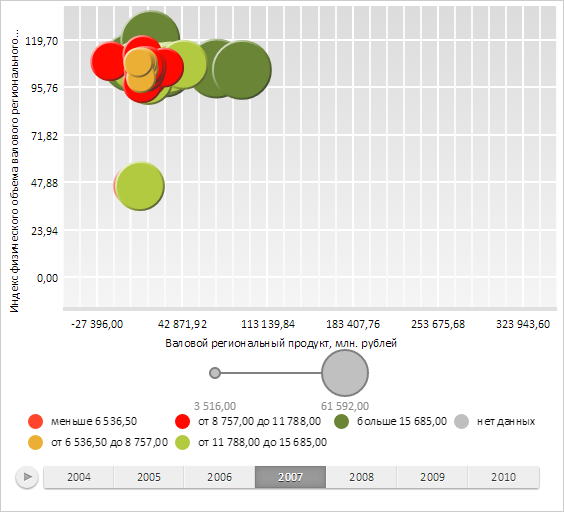

# ChartArea.getHistoryLabelsLayer

ChartArea.getHistoryLabelsLayer
-

**

# ChartArea.getHistoryLabelsLayer

## Синтаксис

getHistoryLayer();

## Описание

Метод getHistoryLabelsLayer
 возвращает** SVG-элемент,
 содержащий слой меток истории значений пузырьков пузырьковой диаграммы.

## Комментарии

Метод возвращает значение типа SVGElement.

## Пример

Для выполнения примера необходимо наличие на html-странице компонента
 [BubbleChart](../../../Components/BubbleChart/BubbleChart.htm)
 с наименованием «bubbleChart» (см. «[Пример
 создания компонента BubbleChart](../../../Components/BubbleChart/BubbleChart_Example.htm)»). Отобразим историю первого пузырька
 и проверим существование истории пузырька в точке с координатами (60,
 170):

// Устанавливаем шаг временной шкалы
bubbleChart.setTimelineStep(3);
// Отображаем историю первого пузырька
bubbleChart.getSeries()[0].getPoints()[0].setIsHistoryOn(true);
// Проверяем существование истории пузырька в точке
if (bubbleChart.getSeries()[0].getPoints()[0].getHistory().getPointUnderMouse()) {
    console.log("История пузырька в заданной точке существует");
} else {
    console.log("История пузырька в заданной точке отсутствует");
}
В результате на пузырьковой диаграмме была отображена история первого пузырька:

В консоль был выведен результат проверки существования истории пузырька
 в точке:

История пузырька в заданной точке существует

Очистим слой меток истории значений пузырьков пузырьковой диаграммы:

// Очищаем слой меток истории значений пузырьков пузырьковой диаграммы
bubbleChart.getChartArea().getHistoryLabelsLayer().remove();
В результате был очищен слой меток истории значений пузырьков:

См. также:

[ChartArea](ChartArea.htm)

		Справочная
		 система на версию 10.9
		 от 18/08/2025,
		 © ООО «ФОРСАЙТ»,
