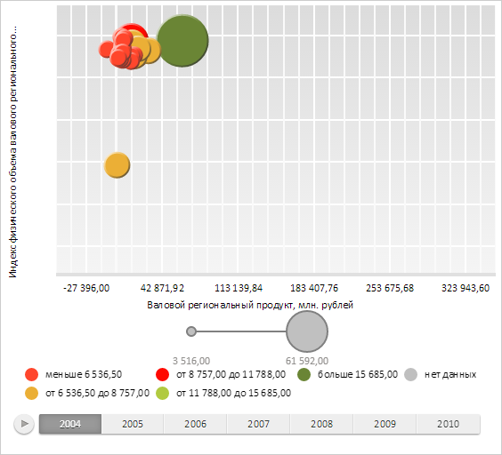

# ChartArea.getLeftLabelLayer

ChartArea.getLeftLabelLayer
-

# ChartArea.getLeftLabelLayer

## Синтаксис

getLeftLabelLayer();

## Описание

Метод getLeftLabelLayer возвращает
 SVG-элемент, предназначенный для отрисовки слоя меток оси Y пузырьковой диаграммы.

## Комментарии

Метод возвращает значение типа SVGElement.

## Пример

Для выполнения примера необходимо наличие на html-странице компонента
 [BubbleChart](../../../Components/BubbleChart/BubbleChart.htm)
 с наименованием «bubbleChart» (см. «[Пример
 создания компонента BubbleChart](../../../Components/BubbleChart/BubbleChart_Example.htm)»). Получим значение ширины области
 меток оси Y:

// Получаем область построения пузырьковой диаграммы
var chartArea = bubbleChart.getChartArea();
// Получаем ширину области меток оси Y
console.log("Ширина области меток оси Y: " + chartArea.getLeftLabelLayerWidth());
В результате в консоль была выведена ширина области меток оси Y:

Ширина области меток оси Y: 43

Очистим слой меток оси Y:

// Очищаем слой меток оси Y
chartArea.getLeftLabelLayer().children[0].remove();
В результате у пузырьковой диаграммы был удален слой меток оси Y:

См. также:

[ChartArea](ChartArea.htm)

		Справочная
		 система на версию 10.9
		 от 18/08/2025,
		 © ООО «ФОРСАЙТ»,
