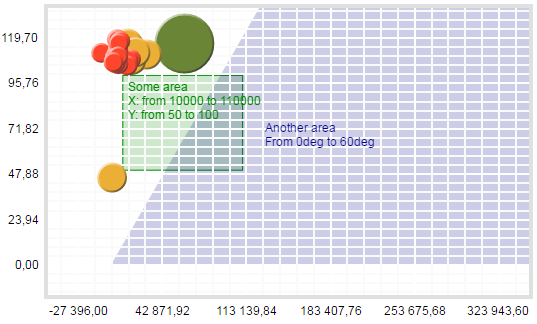

# ChartArea.setAreaFill

ChartArea.setAreaFill
-

# ChartArea.setAreaFill

## Синтаксис

setAreaFill(value: Array);

## Параметры

value. Массив элементов классов
 [PP.Ui.ChartAreaFill](../ChartAreaFill/ChartAreaFill.htm) и/или
 [PP.Ui.ChartSectorFill](../ChartSectorFill/ChartSectorFill.htm).

## Описание

Метод setAreaFill добавляет
 элементы заливки области построения пузырьковой диаграммы.

## Пример

Для выполнения примера необходимо наличие на html-странице компонента
 [BubbleChart](../../../Components/BubbleChart/BubbleChart.htm)
 с наименованием «bubbleChart» (см. «[Пример
 создания компонента BubbleChart](../../../Components/BubbleChart/BubbleChart_Example.htm)»). Создадим области заливки на пузырьковой
 диаграмме:

// Получим область диаграммы
chartArea = bubbleChart.getChartArea();

// Зададим прямоугольную область заливки
areaFillSettings = {
  "Label": {
    "Padding": "5,5,5,5",
    "HorizontalAlignment": "Left",
    "VerticalAlignment": "Top",
    "MaskText": "Some area\nX: from {%Left} to {%Right}\nY: from {%Top} to {%Bottom}",
    "Style": {
      "Release": {
        "Font": {
          "Color": "#008800"
        }
      }
    }
  },
  "Left": "10000",
  "Top": "50",
  "Width": "100000",
  "Height": "50",
  "Fill": {
    "Color": "#008800",
    "Opacity": "0.2"
  },
  "Stroke": "#008800",
  "PPType": "PP.Ui.ChartAreaFill"
};

// Зададим угловую область заливки
angleFillSettings = {
  "Label": {
    "Padding": "5,5,5,5",
    "MaskText": "Another area\nFrom {%Start}deg to {%End}deg",
    "Style": {
      "Release": {
        "Font": {
          "Color": "#000088"
        }
      }
    }
  },
  "Start": "0",
  "Angle": "60",
  "Fill": {
    "Color": "#000088",
    "Opacity": "0.2"
  }
};

// Применим настройки заливки
chartArea.setAreaFill(areaFillSettings);
chartArea.setAreaFill(angleFillSettings);
// Обновим компонент
bubbleChart.refreshAll();
В результате была произведена заливка прямоугольной и угловой областей
 пузырьковой диаграммы:

См. также:

[ChartArea](ChartArea.htm)

		Справочная
		 система на версию 10.9
		 от 18/08/2025,
		 © ООО «ФОРСАЙТ»,
