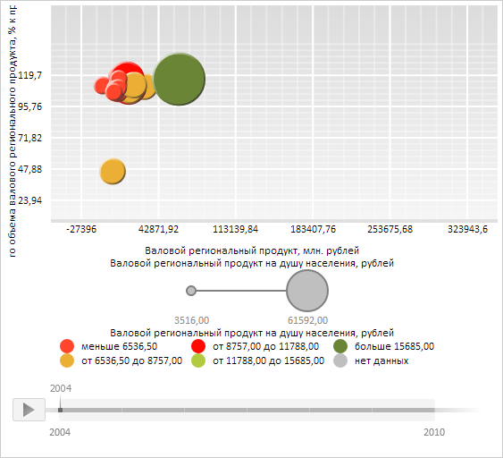

# ChartAxis.MaxValue

ChartAxis.MaxValue
-

**

# ChartAxis.MaxValue

## Синтаксис

MaxValue: Number

## Описание

Свойство MaxValue** определяет максимальное значение оси пузырьковой диаграммы.

## Комментарии

Значение свойства устанавливается с помощью метода setMaxValue, а возвращается с помощью метода getMaxValue. Из JSON значение свойства установить нельзя.

## Пример

Для выполнения примера необходимо наличие на html-странице компонента [BubbleChart](../../../Components/BubbleChart/BubbleChart.htm) с наименованием «bubbleChart» (см. «[Пример создания компонента BubbleChart](../../../Components/BubbleChart/BubbleChart_Example.htm)»). Установим новое максимальное и минимальное значение оси Y, а также получим сдвиг данной оси от края пузырьковой диаграммы:

// Получим область пузырьковой диаграммы
var chartArea = bubbleChart.getChartArea();
// Получим ось Y
var axisY = chartArea.getAxisY();
// Установим новое максимальное значение оси
axisY.setMaxValue(150);
// Установим новое минимальное значение оси
axisY.setMinValue(30);
// Обновим диаграмму
bubbleChart.refresh();
// Расчитаем сдвиг оси от края пузырьковой диаграммы
var offset = axisY.calcOffset();
// Выведем полученные данные
console.log("Сдвиг оси Y от края пузырьковой диаграммы: " + offset);

В результате выполнения примера было установлено новое максимальное и минимальное значение оси Y:

Также в консоль браузера было выведено значение сдвига оси Y от края пузырьковой диаграммы:

Сдвиг оси Y от края пузырьковой диаграммы: 37

См. также:

[ChartAxis](ChartAxis.htm)

		Справочная
		 система на версию 10.9
		 от 18/08/2025,
		 © ООО «ФОРСАЙТ»,
