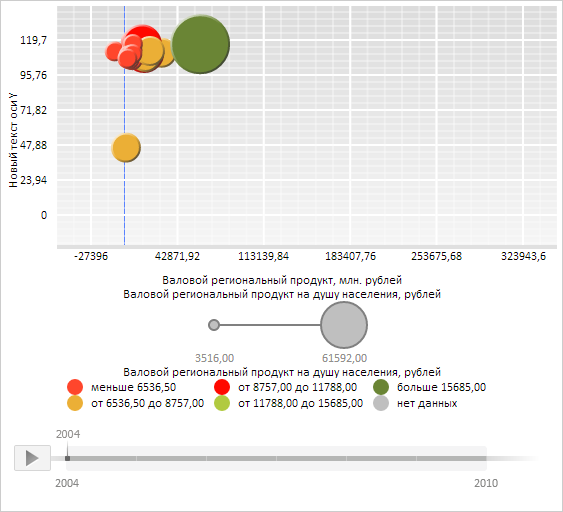

# Конструктор ChartAxis

Конструктор ChartAxis
-

# Конструктор ChartAxis

## Синтаксис

PP.Ui.ChartAxis(settings);

## Параметры

settings. JSON-объект
 со значениями свойств компонента.

## Описание

Конструктор ChartAxis создает
 экземпляр класса [ChartAxis](ChartAxis.htm).

## Пример

Для выполнения примера необходимо наличие на html-странице компонента
 [BubbleChart](../../../Components/BubbleChart/BubbleChart.htm)
 с наименованием «bubbleChart» (см. «[Пример
 создания компонента BubbleChart](../../../Components/BubbleChart/BubbleChart_Example.htm)»). Создадим и отобразим новую ось
 Y пузырьковой диаграммы:

// Получим область пузырьковой диаграммы
var chartArea = bubbleChart.getChartArea();
// Получим ось Y
var axisY = chartArea.getAxisY();
// Уничтожим объект оси Y
axisY.dispose();
// Определим заголовок оси
var axisCaption = new PP.Ui.ChartLabel({
    Text: "Новый текст оси Y"
});
// Определим метки оси
var axisMarkers = new PP.Ui.MarkerCollection({});
// Определим кисть оси
var stroke = new PP.SolidColorBrush({
    Color: "#3366FF"
});
// Определим параметры для конструктора
var settings = {
    AutoMax: true,
    AutoMin: true,
    AxisCrossValue: 0,
    Caption: axisCaption,
    Markers: axisMarkers,
    Stroke: stroke,
    Thickness: 1,
    Type: PP.Ui.VisualType.Y,
    Chart: bubbleChart
};
// Создадим новый объект оси
var newAxisY = new PP.Ui.ChartAxis(settings);
// Установим новый объект оси
chartArea.setAxisY(newAxisY);
// Отрисуем содержимое нового объекта оси в области левых меток
newAxisY.draw(chartArea.getPaperArea());
// Отобразим пузырьки пузырьковой диаграммы без данных
newAxisY.setShowBubblesWithNoData(true);
// Обновим пузырьковую диаграмму
bubbleChart.refresh();

В результате выполнения примера была создана и отображена новая ось
 Y пузырьковой диаграммы:

См. также:

[ChartAxis](ChartAxis.htm)

		Справочная
		 система на версию 10.9
		 от 18/08/2025,
		 © ООО «ФОРСАЙТ»,
