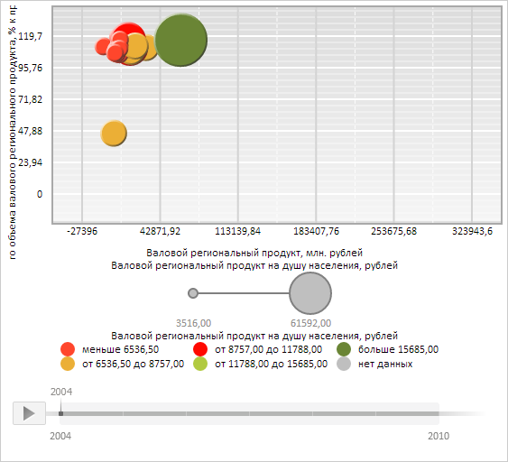

# Конструктор ChartGrid

Конструктор ChartGrid
-

# Конструктор ChartGrid

## Синтаксис

PP.Ui.ChartGrid (settings);

## Параметры

settings. JSON-объект
 со значениями свойств класса.

## Описание

Конструктор ChartGrid создает
 экземпляр класса [ChartGrid](ChartGrid.htm).

## Пример

Для выполнения примера необходимо наличие на html-странице компонента
 [BubbleChart](../../../Components/BubbleChart/BubbleChart.htm)
 с наименованием «bubbleChart» (см. «[Пример
 создания компонента BubbleChart](../../../Components/BubbleChart/BubbleChart_Example.htm)»). Нарисуем в пузырьковой диаграмме новую координатную
 сетку:

// Уничтожим старую координатную сетку пузырьковой диаграммы
bubbleChart.getChartArea().getGrid().dispose();
// Создадим новую координатную сетку
var grid = new PP.Ui.ChartGrid({
    // Устанавливаем плавное исчезновение линий при изменении масштаба координатной сетки
    SmoothDisappear: true,
    Chart: bubbleChart,
    // Зададим стиль границы координатной сетки
    BorderBrush: new PP.SolidColorBrush({
        Color: PP.Color.Colors.darkgrey, // Тёмно-серый цвет
        Enabled: true,
        Opacity: 1 // Непрозрачная граница
    }),
    BorderThickness: 2, // Толщина границы
    // Отобразим все границы
    Bottom: true,
    Left: true,
    Right: true,
    Top: true,
    // Определим горизонтальные и вертикальные линии сетки пузырьковой диаграммы
    Horizontals: PP.Ui.ChartArea.DEFAULT_HORIZONTALS,
    Verticals: new PP.Ui.ChartGridLineCollection({
        // Коллекция основных вертикальных линий
        Chart: bubbleChart,
        LineType: "solid", // Сплошной тип линии
        IntervalsCount: "5", // Количество интервалов, образуемые линиями
        Stroke: PP.Color.Colors.lightgray, // Светло-серый цвет
        SubLines: {
            // Коллекция дополнительных вертикальных линий
            LineType: "dash", // Штриховая линия
            IntervalsCount: "2",
            Stroke: PP.Color.Colors.white,
            Thickness: "1",
        },
        Thickness: "2" // Толщина линии
    })
});
// Нарисуем в пузырьковой диаграмме координатную сетку
grid.draw(bubbleChart.getChartArea().getPaperArea());
// Добавим к координатной сетке линии её границы
grid.toFront();
В результате выполнения примера в пузырьковой диаграмме была нарисована новая координатная
 сетка с тёмно-серыми непрозрачными границами.

Горизонтальные линии сетки имеют настройки по умолчанию.

Для основных вертикальных линий задан светло-серый цвет, сплошной тип,
 толщина в 2 пикселя, и количество интервалов, образуемых линиями, равное
 5. Для дополнительных вертикальных линий установлены два интервала, белый
 цвет заливки, штриховой тип и толщина в 1 пиксель:

См. также:

[ChartGrid](ChartGrid.htm)

		Справочная
		 система на версию 10.9
		 от 18/08/2025,
		 © ООО «ФОРСАЙТ»,
