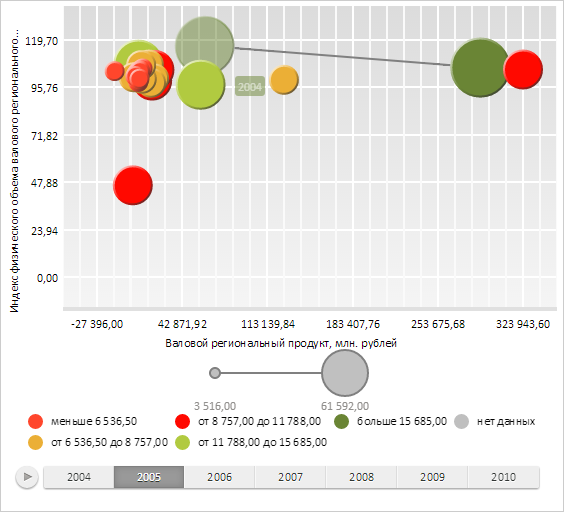

# ChartHistory.animate

ChartHistory.animate
-

**

# ChartHistory.animate

## Синтаксис

animate(step: Number);

## Параметры

*step.* Доля анимации для воспроизведения. Параметр может принимать
 числовое значение от 0 до 1 включительно.

## Описание

Метод animate** рассчитывает
 положение истории значений пузырька на заданном шагу анимации.

## Комментарии

Для выполнения примера необходимо наличие на html-странице компонента
 [BubbleChart](../../../Components/BubbleChart/BubbleChart.htm)
 с наименованием «bubbleChart» (см. «[Пример
 создания компонента BubbleChart](../../../Components/BubbleChart/BubbleChart_Example.htm)»). Изменим шаг временной шкалы и перерисуем
 историю одного из пузырьков:

// Меняем шаг временной шкалы
bubbleChart.setTimelineStep(1);
// Отображаем историю пузырька
bubbleChart.getSeries()[26].getPoints()[0].setIsHistoryOn(true);
// Очищаем слой истории меток
bubbleChart.getChartArea().getHistoryLayer().clear();
// Изменяем положение истории пузырька
var his = bubbleChart.getSeries()[26].getPoints()[0].getHistory();
his.animate(1);
// Отрисовываем историю пузырька
his.renderFrame(bubbleChart.getChartArea().getHistoryLayer());
В результате будет отрисована история значений одного из пузырьков:

См. также:

[ChartHistory](ChartHistory.htm)

		Справочная
		 система на версию 10.9
		 от 18/08/2025,
		 © ООО «ФОРСАЙТ»,
