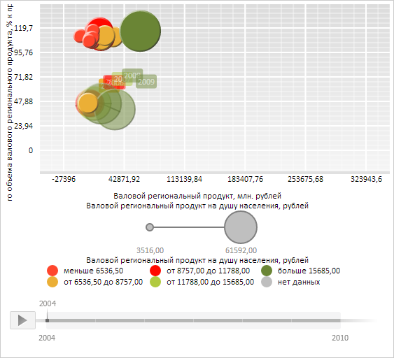

# Конструктор ChartHistory

Конструктор ChartHistory
-

# Конструктор ChartHistory

## Синтаксис

PP.Ui.ChartHistory(settings);

## Параметры

settings. JSON-объект со значениями свойств компонента.

## Описание

Конструктор ChartHistory создает экземпляр класса [ChartHistory](ChartHistory.htm).

## Пример

Для выполнения примера необходимо наличие на html-странице компонента [BubbleChart](../../../Components/BubbleChart/BubbleChart.htm) с наименованием «bubbleChart» (см. «[Пример создания компонента BubbleChart](../../../Components/BubbleChart/BubbleChart_Example.htm)»). Отобразим историю значений для первой точки первого ряда данных пузырьковой диаграммы:

// Получим массив рядов пузырьковой диаграммы
var series = bubbleChart.getSeries();
// Получим ряд с индексом 0
var serie = series[0];
// Получим первую точку ряда
var chartSeriePoint = serie.getPoints()[0];
// Создадим объект для отображения истории значений данного ряда
var history = new PP.Ui.ChartHistory({
    Chart: bubbleChart, // пузырьковая диаграмма
    IsVisible: true // Историю значений делаем видимой
});
// Укажем точку, для которой будем отображать историю значений
history.setPoint(chartSeriePoint);
// Отрисуем историю на пузырьковой диаграмме
history.draw(bubbleChart.getChartArea().getHistoryLayer());

В результате выполнения примера в пузырьковой диаграмме была отображена история значений для первой точки первого ряда данных:

См. также:

[ChartHistory](ChartHistory.htm)

		Справочная
		 система на версию 10.9
		 от 18/08/2025,
		 © ООО «ФОРСАЙТ»,
