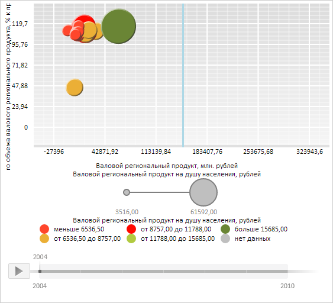

# Конструктор ChartLine

Конструктор ChartLine
-

# Конструктор ChartLine

## Синтаксис

PP.Ui.ChartLine (settings);

## Параметры

settings. JSON-объект
 со значениями свойств класса.

## Описание

Конструктор ChartLine создает
 экземпляр класса [ChartLine](ChartLine.htm).

## Пример

Для выполнения примера необходимо наличие на html-странице компонента
 [BubbleChart](../../../Components/BubbleChart/BubbleChart.htm)
 с наименованием «bubbleChart» (см. «[Пример
 создания компонента BubbleChart](../../../Components/BubbleChart/BubbleChart_Example.htm)»). Нарисуем в области построения пузырьковой диаграммы
 вертикальную линию уровня, соответствующую значению 150000 по оси X:

// Создадим линию уровня в пузырьковой диаграмме
var chartLine = new PP.Ui.ChartLine({
    Chart: bubbleChart,
    Stroke: PP.Color.Colors.lightblue, // Голубой цвет
    Thickness: 3, // Толщина линии уровня
    Value: 150000 // Значение, которому соответствует линия уровня
});
// Отрисуем созданную линию уровня в пузырьковой диаграмме
chartLine.draw(bubbleChart.getChartArea().getPaperArea(), PP.Ui.VisualType.X);
// Получим координаты линии уровня по осям X и Y
console.log("Координата линии уровня по оси X: " + chartLine.getPrimaryCoord(PP.Ui.VisualType.X));
console.log("Координата линии уровня по оси Y: " + chartLine.getPrimaryCoord(PP.Ui.VisualType.Y));
В результате выполнения примера в области построения пузырьковой диаграммы была нарисована
 вертикальная линия уровня голубого цвета с толщиной в 3 пикселя, соответствующая
 значению 150000 по оси X:

В консоли браузера были выведены координаты созданной линии:

Координата линии уровня по оси X: 251.61758708668194

Координата линии уровня по оси Y: -219089.24561403508

См. также:

[ChartLine](ChartLine.htm)

		Справочная
		 система на версию 10.9
		 от 18/08/2025,
		 © ООО «ФОРСАЙТ»,
