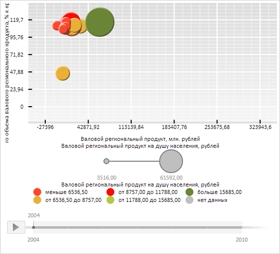

# Конструктор ChartMarker

Конструктор ChartMarker
-

# Конструктор ChartMarker

## Синтаксис

PP.Ui.ChartMarker(settings);

## Параметры

settings. JSON-объект со значениями свойств класса.

## Описание

Конструктор ChartMarker создает экземпляр класса [ChartMarker](ChartMarker.htm).

## Пример

Для выполнения примера необходимо наличие на html-странице компонента [BubbleChart](../../../Components/BubbleChart/BubbleChart.htm) с наименованием «bubbleChart» (см. «[Пример создания компонента BubbleChart](../../../Components/BubbleChart/BubbleChart_Example.htm)»). Установим метки для осей X и Y пузырьковой диаграммы:

// Получим область пузырьковой диаграммы
var chartArea = bubbleChart.getChartArea();
// Определим параметры метки
var settings = {
    Length: 15, // Длина меток
    Chart: bubbleChart,
    Stroke: PP.Color.Colors.black, // Чёрный цвет меток
    Thickness: 2 // Толщина меток в пикселях
};
// Получим вертикальные линии уровня оси для оси X
var xItems = chartArea.getGrid().getVerticals()._Items;
for (var i in xItems) {
    // Создадим новую меткy оси
    var marker = new PP.Ui.ChartMarker(settings);
    // Зададим новое значение для метки оси
    var value = xItems[i].getValue();
    marker.setValue(value);
    // Отрисуем метку
    var secondCoord = bubbleChart.getChartArea().getPaperArea();
    marker.draw(bubbleChart.getChartArea()._GridLayer, PP.Ui.VisualType.X, secondCoord);
};
// Получим горизонтальные линии уровня для оси Y
var yItems = chartArea.getGrid().getHorizontals()._Items;
for (var i in yItems) {
    // Создадим новую меткy оси
    var marker = new PP.Ui.ChartMarker(settings);
    // Зададим новое значение для метки оси
    var value = yItems[i].getValue();
    marker.setValue(value);
    // Отрисуем метку
    marker.draw(bubbleChart.getChartArea()._GridLayer, PP.Ui.VisualType.Y, 0)
};

В результате выполнения примера для осей X и Y пузырьковой диаграммы были установлены метки чёрного цвета с длиной в 15 пикселей и толщиной в 2 пикселя:

См. также:

[ChartMarker](ChartMarker.htm)

		Справочная
		 система на версию 10.9
		 от 18/08/2025,
		 © ООО «ФОРСАЙТ»,
