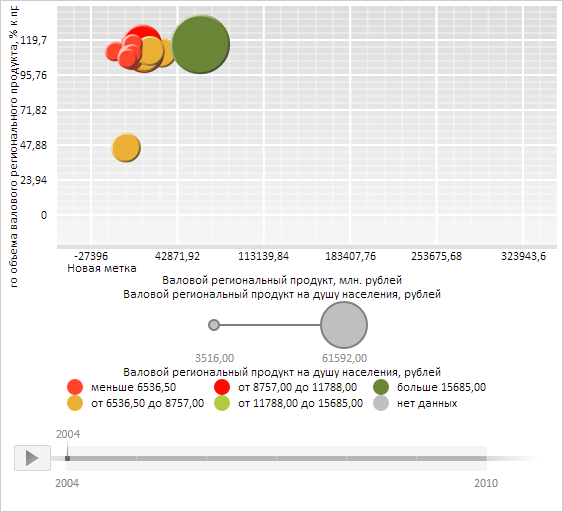

# Конструктор ChartSVGLabel

Конструктор ChartSVGLabel
-

# Конструктор ChartSVGLabel

## Синтаксис

PP.Ui.ChartSVGLabel(settings);

## Параметры

settings. JSON-объект со значениями свойств компонента.

## Описание

Конструктор ChartSVGLabel создает экземпляр класса [ChartSVGLabel](ChartSVGLabel.htm).

## Пример

Для выполнения примера необходимо наличие на html-странице компонента [BubbleChart](../../../Components/BubbleChart/BubbleChart.htm) с наименованием «bubbleChart» (см. «[Пример создания компонента BubbleChart](../../../Components/BubbleChart/BubbleChart_Example.htm)»). Создадим новую текстовую метку, отрисуем её внутри SVG-элемента и изменим её положение:

// Создадим новую текстовую метку SVG-элемента пузырьковой диаграммы
var svg = new PP.Ui.ChartSVGLabel({
    Opacity: 1,
    Left: 5,
    Top: 5,
    Text: "Новая метка"
});
// Отрисуем метку внутри SVG-элемента
svg.draw(false, bubbleChart.getChartArea().getPaperArea());
// Изменим позицию метки
svg.setPosition(10, 12);

В результате выполнения примера была создана и отрисована текстовая метка, также было изменено её положение:

См. также:

[ChartSVGLabel](ChartSVGLabel.htm)

		Справочная
		 система на версию 10.9
		 от 18/08/2025,
		 © ООО «ФОРСАЙТ»,
