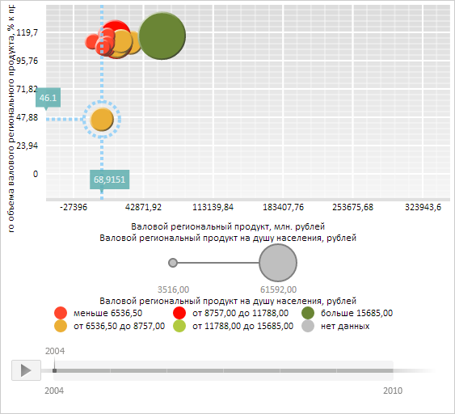

# Конструктор ChartSelection

Конструктор ChartSelection
-

# Конструктор ChartSelection

## Синтаксис

PP.Ui.ChartSelection(settings);

## Параметры

settings. JSON-объект
 со значениями свойств класса.

## Описание

Конструктор ChartSelection создает
 экземпляр класса [ChartSelection](ChartSelection.htm).

## Пример

Для выполнения примера необходимо наличие на html-странице компонента
 [BubbleChart](../../../Components/BubbleChart/BubbleChart.htm)
 с наименованием «bubbleChart» (см. «[Пример
 создания компонента BubbleChart](../../../Components/BubbleChart/BubbleChart_Example.htm)»). Выделим пузырёк из первого ряда
 данных:

// Получим массив рядов пузырьковой диаграммы
var series = bubbleChart.getSeries();
// Получим пузырёк из первого ряда данных
var chartSeriePoint = series[0].getPoints()[0];
// Разрешим выделение пузырьков в пузырьковой диаграмме
chartSeriePoint._selectionOn = true;
// Получим выделение указанного пузырька пузырьковой диаграммы
var oldSelection = chartSeriePoint.getSelection();
if (oldSelection != null) {
    // Спрячем старое выделение, если оно отображается
    oldSelection.hide();
}
//Создадим новое выделение
var newSelection = new PP.Ui.ChartSelection({
    Chart: bubbleChart,
    HorizontalLine: true, // Нарисуем горизонтальную линию уровня, соответствующую пузырьку
    HorizontalLineExtension: false, // После пузырька линию уровня рисовать не будем
    VerticalLine: true, // Нарисуем вертикальную линию уровня, соответствующую пузырьку
    VerticalLineExtension: true, // Продолжим вертикальную линию уровня после пузырька
    Thickness: 4, // Толщина линии выделения
    LineType: PP.Ui.LineTypes.Dash, //Тип линии
    Offset: 10, // Отступ откружности выделения от границы пузырька пузырьковой диаграммы
    Stroke: PP.Color.Colors.lightskyblue,
    XLabel: new PP.Ui.ChartTooltip({ //Подпись на оси Х
        HasMask: true,
        MaskText: "{%Value:#,##.0000}"
    }),
    YLabel: new PP.Ui.ChartTooltip({ //Подпись на оси У
        HasMask: false,
        Text: chartSeriePoint.getTooltipValues().YValue.toString()
    })
});
// Определим координаты центральной точки пузырька
var cx = chartSeriePoint.getSymbol().getX();
var cy = chartSeriePoint.getSymbol().getY();
// Определим радиус круга выделения
var radius = newSelection.getOffset();
// Определим уровень прозрачности выделения
var opacity = 0.8;
// Отрисуем выделение
newSelection.draw(bubbleChart.getChartArea().getPaper(), cx, cy, radius, cx, cy, opacity);

В результате выполнения примера был выделен пузырёк из первого ряда
 данных. Линии выделения и уровня, соответствующие данному пузырьку, являются
 пунктирными, имеют толщину в 4 пикселя и окрашены в голубой цвет. На пересечениях
 вертикальной и горизонтальной линий уровня с осями X и Y отображены метки,
 содержащие значения координат выделенного пузырька пузырьковой диаграммы:

См. также:

[ChartSelection](ChartSelection.htm)

		Справочная
		 система на версию 10.9
		 от 18/08/2025,
		 © ООО «ФОРСАЙТ»,
